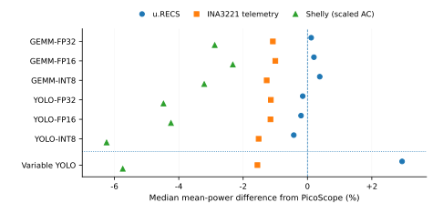
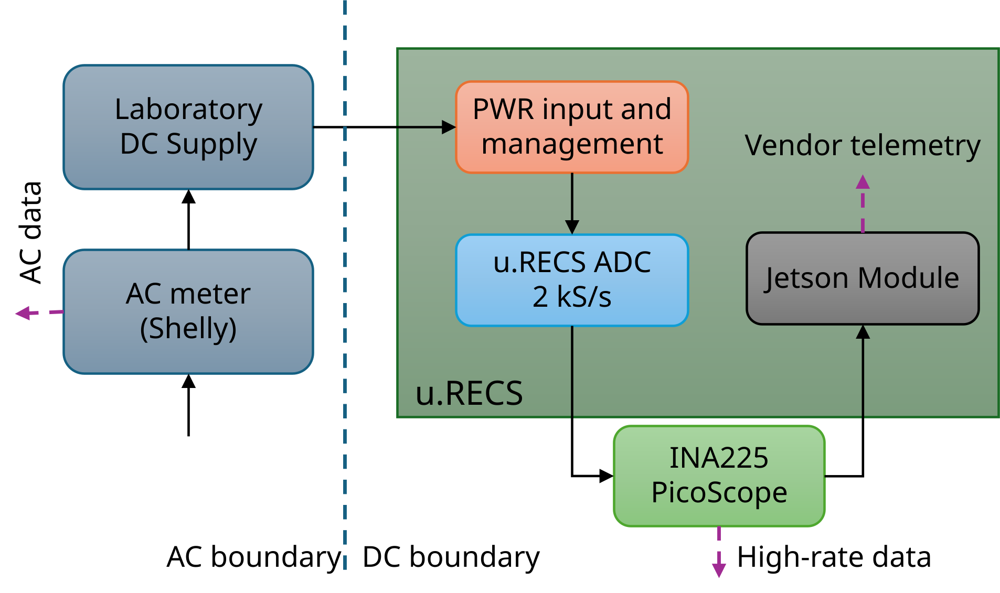

# Abbildungen: paper-parma

[Zurück](README.md)

**Einordnung:** PARMA v0.15.1.

[PARMA-Quellenzuordnung](../../../papers/parma-v0.15.1/SOURCE_MAPPING.md).

## device pair medians

PARMA-Paket; Umfang siehe Quellenzuordnung

[PDF](../../../papers/parma-v0.15.1/manuscript/figures/device_pair_medians.pdf) · [SVG](../../../papers/parma-v0.15.1/manuscript/figures/device_pair_medians.svg)

Vorschau öffnen

Quelle: `energy-measurement/papers/parma-v0.15.1/manuscript/figures`

## measurement boundaries

PARMA-Paket; Umfang siehe Quellenzuordnung

[PDF](../../../papers/parma-v0.15.1/manuscript/figures/measurement_boundaries.pdf) · [SVG](../../../papers/parma-v0.15.1/manuscript/figures/measurement_boundaries.svg)

Vorschau öffnen

Quelle: `energy-measurement/papers/parma-v0.15.1/manuscript/figures`
