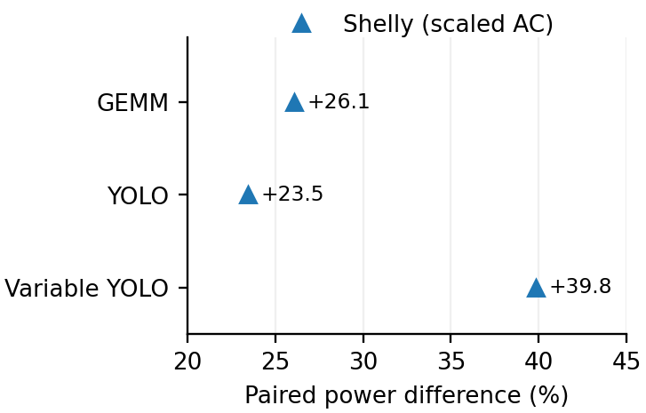
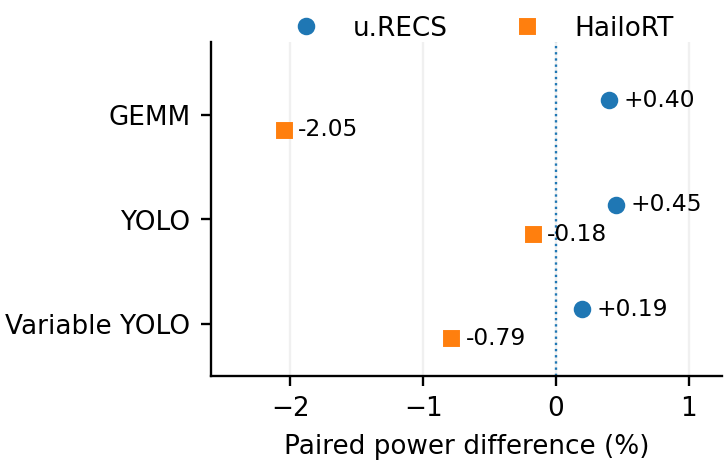
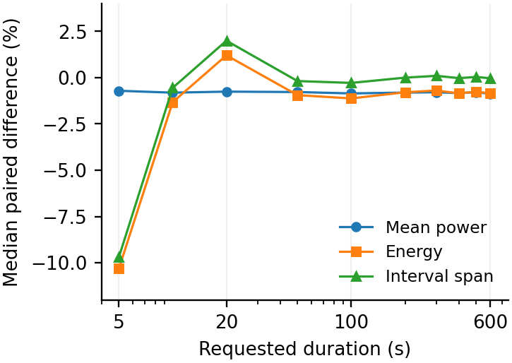
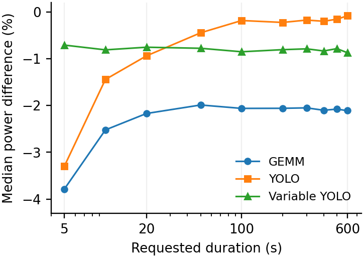
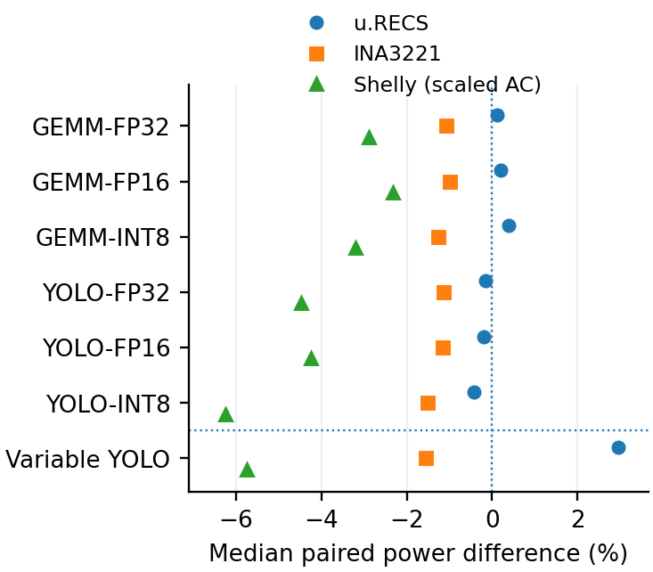

# Abbildungen: paper-tim

[Zurück](README.md)

**Einordnung:** TIM v0.3.

[Vollständige Zuordnung zu den TIM-Abbildungs-/Tabellennummern](../../../papers/tim-v0.3/SOURCE_MAPPING.md).

## Abb. 7b — Hailo: AC-Beobachtung

Hauptabbildung / Haupttabelle

[PDF](../../../papers/tim-v0.3/figures/hailo_ac_context.pdf) · [PNG](../../../papers/tim-v0.3/figures/hailo_ac_context.png)

Vorschau öffnen

Quelle: `energy-measurement/papers/tim-v0.3/figures`

## Abb. 7a — Hailo: DC und Telemetrie

Hauptabbildung / Haupttabelle

[PDF](../../../papers/tim-v0.3/figures/hailo_dc_telemetry.pdf) · [PNG](../../../papers/tim-v0.3/figures/hailo_dc_telemetry.png)

Vorschau öffnen

Quelle: `energy-measurement/papers/tim-v0.3/figures`

## Abb. 8b — Variable YOLO: Energie, Leistung und Spanne

Hauptabbildung / Haupttabelle

[PDF](../../../papers/tim-v0.3/figures/hailo_variable_intervals.pdf) · [PNG](../../../papers/tim-v0.3/figures/hailo_variable_intervals.png)

Vorschau öffnen

Quelle: `energy-measurement/papers/tim-v0.3/figures`

## Abb. 8a — HailoRT über der angeforderten Dauer

Hauptabbildung / Haupttabelle

[PDF](../../../papers/tim-v0.3/figures/hailort_duration.pdf) · [PNG](../../../papers/tim-v0.3/figures/hailort_duration.png)

Vorschau öffnen

Quelle: `energy-measurement/papers/tim-v0.3/figures`

## Abb. 6 — Jetson: reale Messverfahren

Hauptabbildung / Haupttabelle

[PDF](../../../papers/tim-v0.3/figures/jetson_deployed_meters.pdf) · [PNG](../../../papers/tim-v0.3/figures/jetson_deployed_meters.png)

Vorschau öffnen

Quelle: `energy-measurement/papers/tim-v0.3/figures`

## Abb. 1 — Elektrische Messgrenzen

Hauptabbildung / Haupttabelle

[PDF](../../../papers/tim-v0.3/figures/measurement_boundaries.pdf)

Quelle: `energy-measurement/papers/tim-v0.3/figures`
