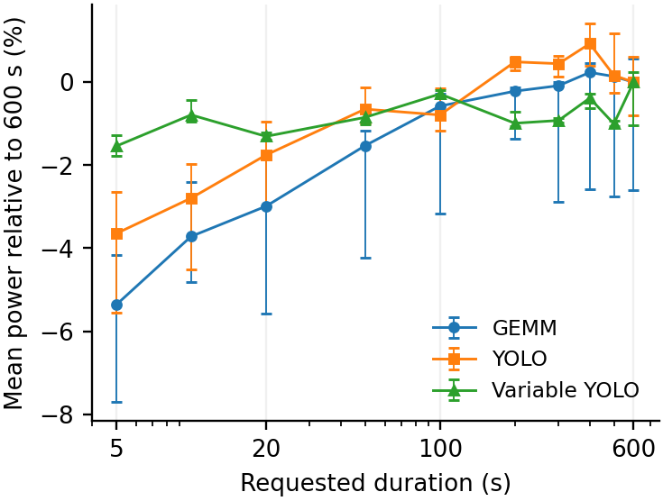
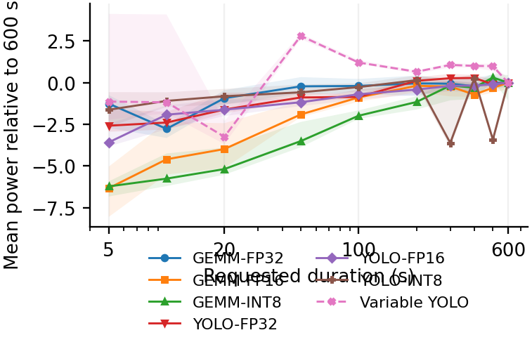
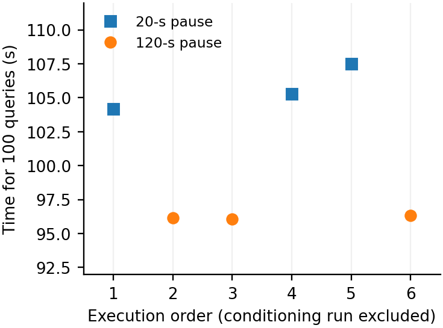

# Abbildungen: paper-tim

[Zurück](README.md)

**Einordnung:** TIM v0.3.

[Vollständige Zuordnung zu den TIM-Abbildungs-/Tabellennummern](../../../papers/tim-v0.3/SOURCE_MAPPING.md).

## Abb. 9b — Hailo: Benchmarkdauer

Hauptabbildung / Haupttabelle

[PDF](../../../papers/tim-v0.3/figures/hailo_duration.pdf) · [PNG](../../../papers/tim-v0.3/figures/hailo_duration.png)

Vorschau öffnen

Quelle: `energy-measurement/papers/tim-v0.3/figures`

## Abb. 9a — Jetson: Benchmarkdauer

Hauptabbildung / Haupttabelle

[PDF](../../../papers/tim-v0.3/figures/jetson_duration.pdf) · [PNG](../../../papers/tim-v0.3/figures/jetson_duration.png)

Vorschau öffnen

Quelle: `energy-measurement/papers/tim-v0.3/figures`

## Abb. 10 — Pausen und Ausführungszeit

Hauptabbildung / Haupttabelle

[PDF](../../../papers/tim-v0.3/figures/pause_runtime.pdf) · [PNG](../../../papers/tim-v0.3/figures/pause_runtime.png)

Vorschau öffnen

Quelle: `energy-measurement/papers/tim-v0.3/figures`
