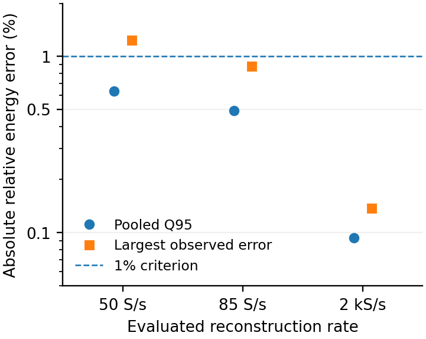
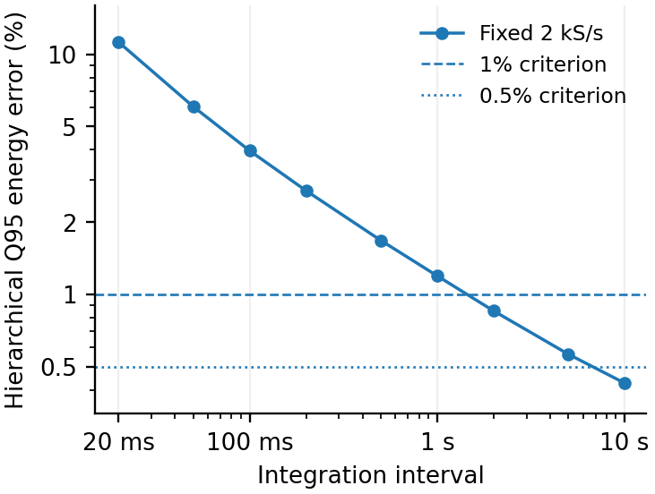

# Abbildungen: paper-tim

[Zurück](README.md)

**Einordnung:** TIM v0.3.

[Vollständige Zuordnung zu den TIM-Abbildungs-/Tabellennummern](../../../papers/tim-v0.3/SOURCE_MAPPING.md).

## Abb. 3a — FP16: Energieintegration

Hauptabbildung / Haupttabelle

[PDF](../../../papers/tim-v0.3/figures/fp16_energy_objective.pdf) · [PNG](../../../papers/tim-v0.3/figures/fp16_energy_objective.png)

Vorschau öffnen

Quelle: `energy-measurement/papers/tim-v0.3/figures`

## Abb. 2 — Jetson: Energiefehler und Integrationsdauer

Hauptabbildung / Haupttabelle

[PDF](../../../papers/tim-v0.3/figures/jetson_rate_duration.pdf) · [PNG](../../../papers/tim-v0.3/figures/jetson_rate_duration.png)

Vorschau öffnen

Quelle: `energy-measurement/papers/tim-v0.3/figures`
