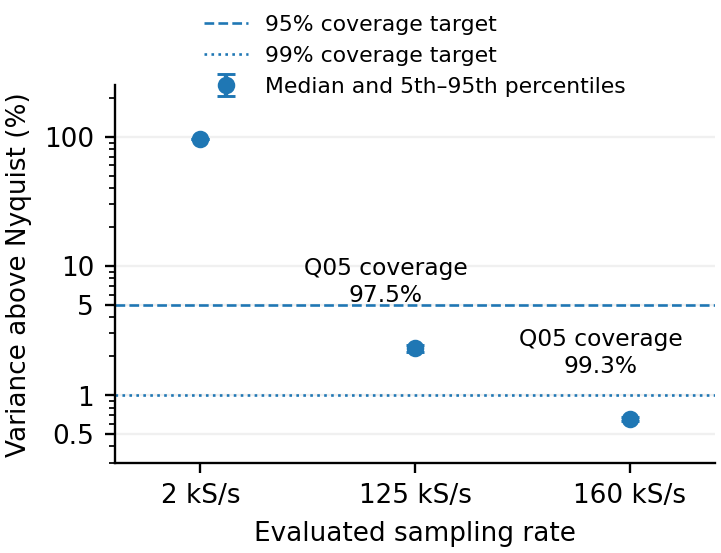
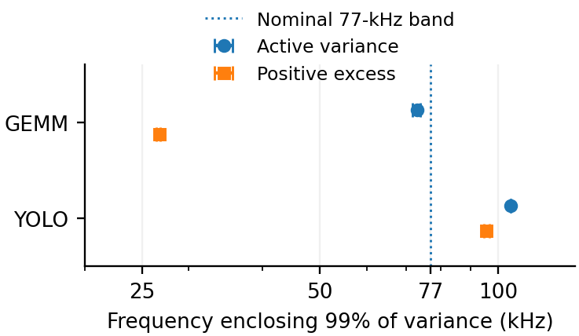
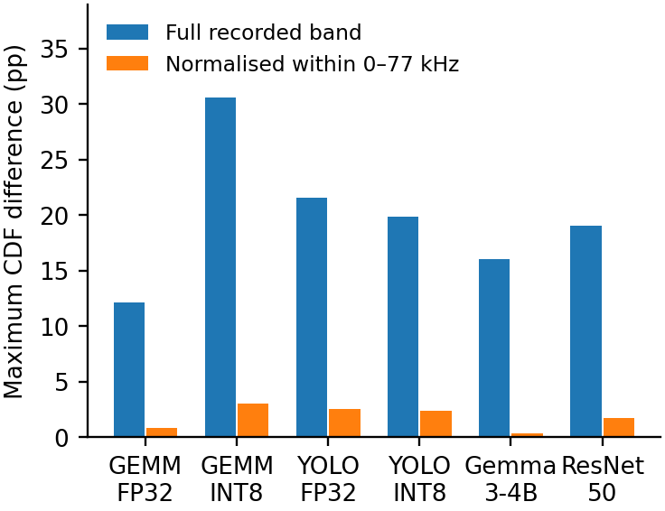

# Abbildungen: paper-tim

[Zurück](README.md)

**Einordnung:** TIM v0.3.

[Vollständige Zuordnung zu den TIM-Abbildungs-/Tabellennummern](../../../papers/tim-v0.3/SOURCE_MAPPING.md).

## Abb. 3b — FP16: Fluktuationsabdeckung

Hauptabbildung / Haupttabelle

[PDF](../../../papers/tim-v0.3/figures/fp16_fluctuation_coverage.pdf) · [PNG](../../../papers/tim-v0.3/figures/fp16_fluctuation_coverage.png)

Vorschau öffnen

Quelle: `energy-measurement/papers/tim-v0.3/figures`

## Abb. 5 — Hailo: spektrale Verteilung

Hauptabbildung / Haupttabelle

[PDF](../../../papers/tim-v0.3/figures/hailo_spectral_tail.pdf) · [PNG](../../../papers/tim-v0.3/figures/hailo_spectral_tail.png)

Vorschau öffnen

Quelle: `energy-measurement/papers/tim-v0.3/figures`

## Abb. 4 — Spektraler Vergleich der Messpfade

Hauptabbildung / Haupttabelle

[PDF](../../../papers/tim-v0.3/figures/native_cdf.pdf) · [PNG](../../../papers/tim-v0.3/figures/native_cdf.png)

Vorschau öffnen

Quelle: `energy-measurement/papers/tim-v0.3/figures`
