# Abbildungen: spectra--journal-psd

[Zurück](README.md)

**Einordnung:** Originale Evidence / Zusatzprüfung.

## hailo power active cumulative

Originale Evidence / Zusatzprüfung; siehe Quellenzuordnung

[PDF](../sources/journal-psd/cross_platform_psd/figures/hailo_power_active_cumulative.pdf) · [PNG](../sources/journal-psd/cross_platform_psd/figures/hailo_power_active_cumulative.png)

Vorschau öffnen

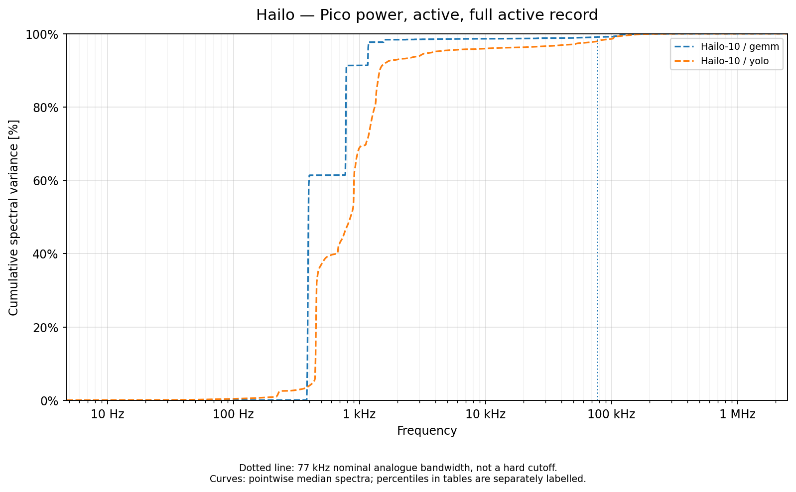

Quelle: `energy-measurement/evidence/spectra/sources/journal-psd/cross_platform_psd/figures`

## hailo power active psd

Originale Evidence / Zusatzprüfung; siehe Quellenzuordnung

[PDF](../sources/journal-psd/cross_platform_psd/figures/hailo_power_active_psd.pdf) · [PNG](../sources/journal-psd/cross_platform_psd/figures/hailo_power_active_psd.png)

Vorschau öffnen

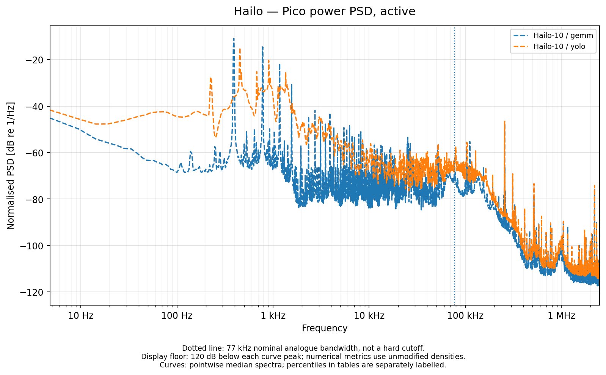

Quelle: `energy-measurement/evidence/spectra/sources/journal-psd/cross_platform_psd/figures`

## hailo power excess cumulative

Originale Evidence / Zusatzprüfung; siehe Quellenzuordnung

[PDF](../sources/journal-psd/cross_platform_psd/figures/hailo_power_excess_cumulative.pdf) · [PNG](../sources/journal-psd/cross_platform_psd/figures/hailo_power_excess_cumulative.png)

Vorschau öffnen

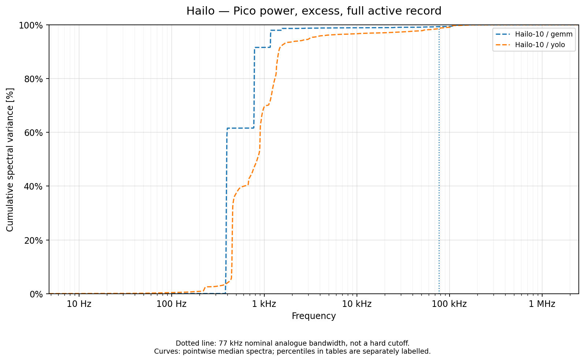

Quelle: `energy-measurement/evidence/spectra/sources/journal-psd/cross_platform_psd/figures`

## hailo power excess psd

Originale Evidence / Zusatzprüfung; siehe Quellenzuordnung

[PDF](../sources/journal-psd/cross_platform_psd/figures/hailo_power_excess_psd.pdf) · [PNG](../sources/journal-psd/cross_platform_psd/figures/hailo_power_excess_psd.png)

Vorschau öffnen

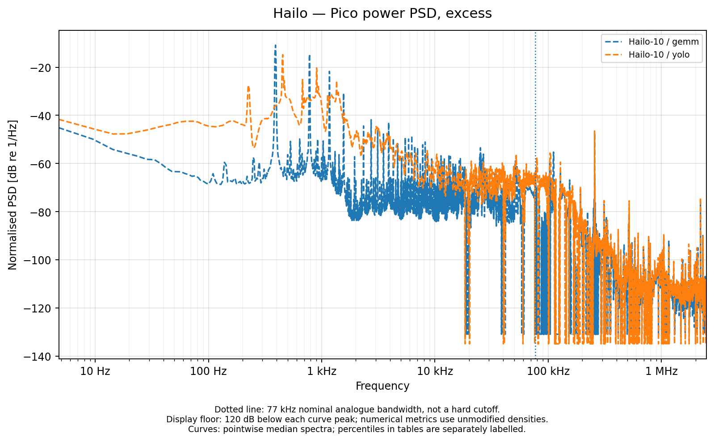

Quelle: `energy-measurement/evidence/spectra/sources/journal-psd/cross_platform_psd/figures`

## jetson vs hailo pico power active conditional 0 77khz

Originale Evidence / Zusatzprüfung; siehe Quellenzuordnung

[PDF](../sources/journal-psd/cross_platform_psd/figures/jetson_vs_hailo_pico_power_active_conditional_0_77khz.pdf) · [PNG](../sources/journal-psd/cross_platform_psd/figures/jetson_vs_hailo_pico_power_active_conditional_0_77khz.png)

Vorschau öffnen

Quelle: `energy-measurement/evidence/spectra/sources/journal-psd/cross_platform_psd/figures`

## jetson vs hailo pico power active cumulative exploratory

Originale Evidence / Zusatzprüfung; siehe Quellenzuordnung

[PDF](../sources/journal-psd/cross_platform_psd/figures/jetson_vs_hailo_pico_power_active_cumulative_exploratory.pdf) · [PNG](../sources/journal-psd/cross_platform_psd/figures/jetson_vs_hailo_pico_power_active_cumulative_exploratory.png)

Vorschau öffnen

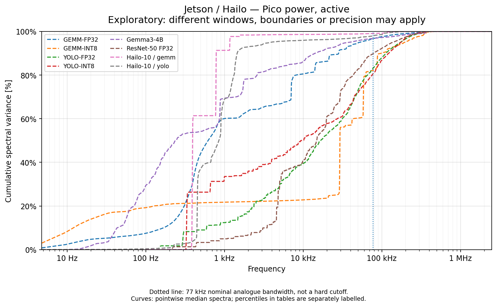

Quelle: `energy-measurement/evidence/spectra/sources/journal-psd/cross_platform_psd/figures`

## jetson vs hailo pico power active matched duration

Originale Evidence / Zusatzprüfung; siehe Quellenzuordnung

[PDF](../sources/journal-psd/cross_platform_psd/figures/jetson_vs_hailo_pico_power_active_matched_duration.pdf) · [PNG](../sources/journal-psd/cross_platform_psd/figures/jetson_vs_hailo_pico_power_active_matched_duration.png)

Vorschau öffnen

Quelle: `energy-measurement/evidence/spectra/sources/journal-psd/cross_platform_psd/figures`

## jetson vs hailo pico power excess conditional 0 77khz

Originale Evidence / Zusatzprüfung; siehe Quellenzuordnung

[PDF](../sources/journal-psd/cross_platform_psd/figures/jetson_vs_hailo_pico_power_excess_conditional_0_77khz.pdf) · [PNG](../sources/journal-psd/cross_platform_psd/figures/jetson_vs_hailo_pico_power_excess_conditional_0_77khz.png)

Vorschau öffnen

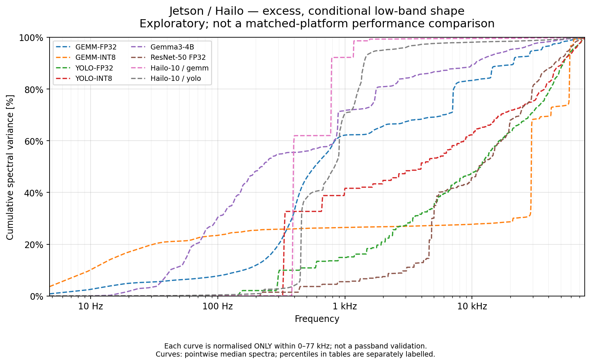

Quelle: `energy-measurement/evidence/spectra/sources/journal-psd/cross_platform_psd/figures`

## jetson vs hailo pico power excess cumulative exploratory

Originale Evidence / Zusatzprüfung; siehe Quellenzuordnung

[PDF](../sources/journal-psd/cross_platform_psd/figures/jetson_vs_hailo_pico_power_excess_cumulative_exploratory.pdf) · [PNG](../sources/journal-psd/cross_platform_psd/figures/jetson_vs_hailo_pico_power_excess_cumulative_exploratory.png)

Vorschau öffnen

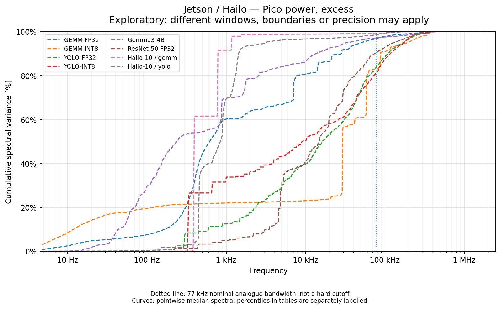

Quelle: `energy-measurement/evidence/spectra/sources/journal-psd/cross_platform_psd/figures`

## jetson vs hailo pico power excess matched duration

Originale Evidence / Zusatzprüfung; siehe Quellenzuordnung

[PDF](../sources/journal-psd/cross_platform_psd/figures/jetson_vs_hailo_pico_power_excess_matched_duration.pdf) · [PNG](../sources/journal-psd/cross_platform_psd/figures/jetson_vs_hailo_pico_power_excess_matched_duration.png)

Vorschau öffnen

Quelle: `energy-measurement/evidence/spectra/sources/journal-psd/cross_platform_psd/figures`

## tek vs pico fine 0 1000hz

Originale Evidence / Zusatzprüfung; siehe Quellenzuordnung

[PDF](../sources/journal-psd/pico_vs_tek_psd/figures/fine_structure/tek_vs_pico_fine_0_1000hz.pdf) · [PNG](../sources/journal-psd/pico_vs_tek_psd/figures/fine_structure/tek_vs_pico_fine_0_1000hz.png)

Vorschau öffnen

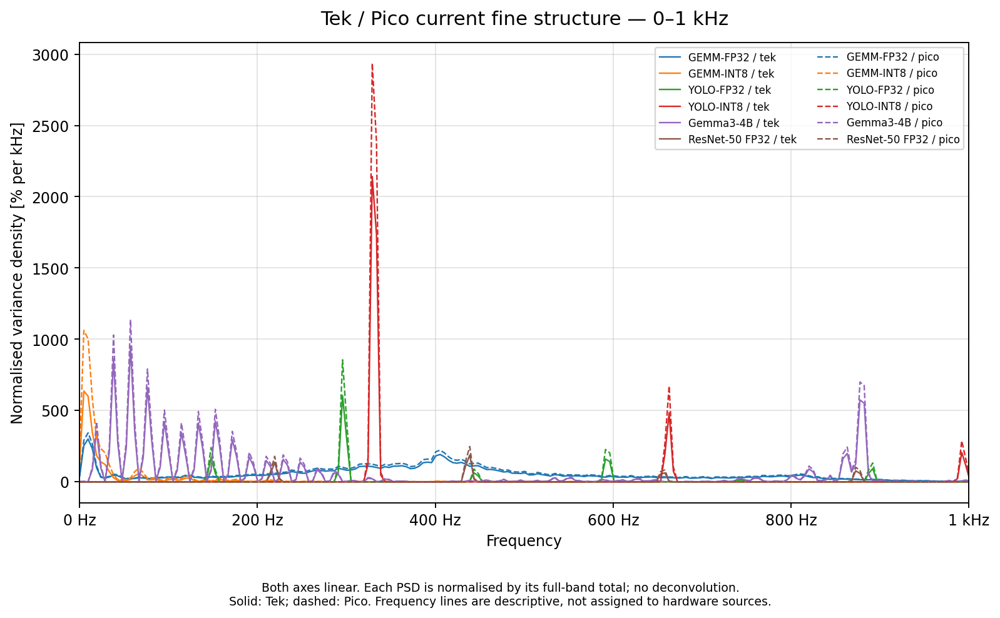

Quelle: `energy-measurement/evidence/spectra/sources/journal-psd/pico_vs_tek_psd/figures/fine_structure`

## tek vs pico fine 1000 8000hz

Originale Evidence / Zusatzprüfung; siehe Quellenzuordnung

[PDF](../sources/journal-psd/pico_vs_tek_psd/figures/fine_structure/tek_vs_pico_fine_1000_8000hz.pdf) · [PNG](../sources/journal-psd/pico_vs_tek_psd/figures/fine_structure/tek_vs_pico_fine_1000_8000hz.png)

Vorschau öffnen

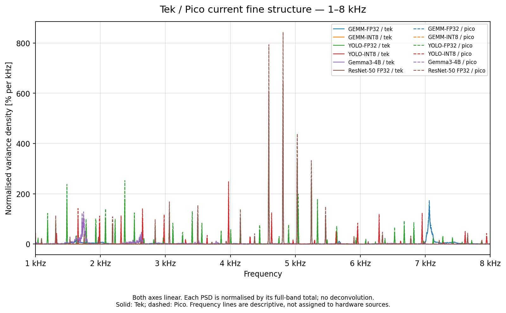

Quelle: `energy-measurement/evidence/spectra/sources/journal-psd/pico_vs_tek_psd/figures/fine_structure`

## tek vs pico fine 25000 35000hz

Originale Evidence / Zusatzprüfung; siehe Quellenzuordnung

[PDF](../sources/journal-psd/pico_vs_tek_psd/figures/fine_structure/tek_vs_pico_fine_25000_35000hz.pdf) · [PNG](../sources/journal-psd/pico_vs_tek_psd/figures/fine_structure/tek_vs_pico_fine_25000_35000hz.png)

Vorschau öffnen

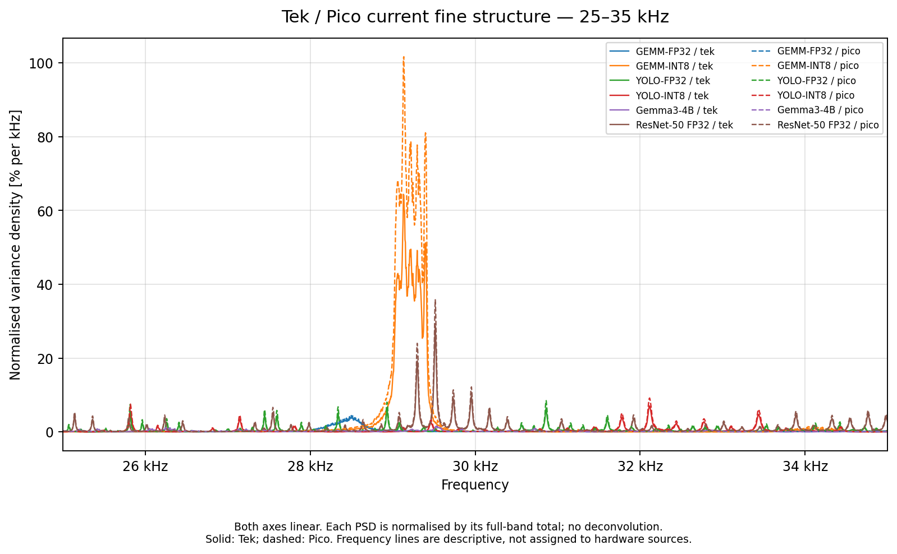

Quelle: `energy-measurement/evidence/spectra/sources/journal-psd/pico_vs_tek_psd/figures/fine_structure`

## tek vs pico fine 300000 700000hz

Originale Evidence / Zusatzprüfung; siehe Quellenzuordnung

[PDF](../sources/journal-psd/pico_vs_tek_psd/figures/fine_structure/tek_vs_pico_fine_300000_700000hz.pdf) · [PNG](../sources/journal-psd/pico_vs_tek_psd/figures/fine_structure/tek_vs_pico_fine_300000_700000hz.png)

Vorschau öffnen

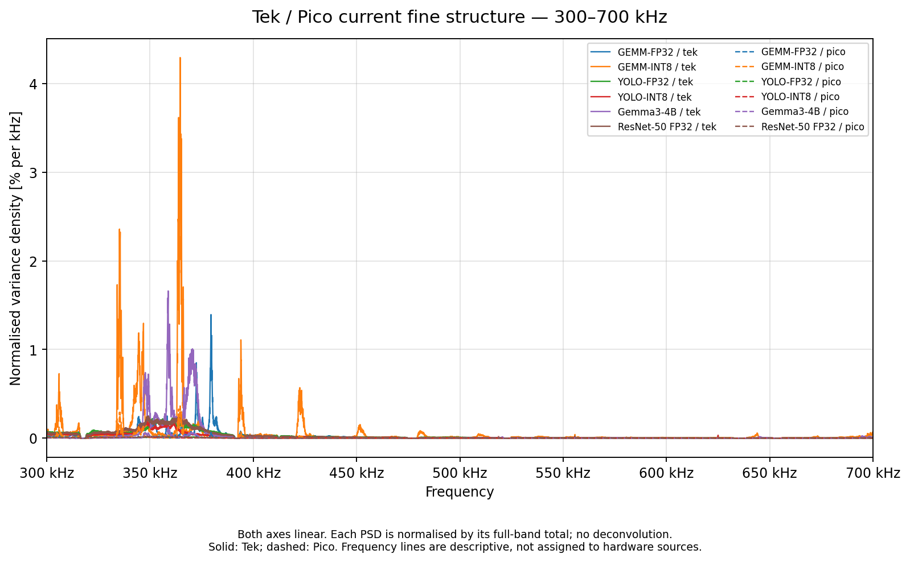

Quelle: `energy-measurement/evidence/spectra/sources/journal-psd/pico_vs_tek_psd/figures/fine_structure`

## tek vs pico fine 8000 16000hz

Originale Evidence / Zusatzprüfung; siehe Quellenzuordnung

[PDF](../sources/journal-psd/pico_vs_tek_psd/figures/fine_structure/tek_vs_pico_fine_8000_16000hz.pdf) · [PNG](../sources/journal-psd/pico_vs_tek_psd/figures/fine_structure/tek_vs_pico_fine_8000_16000hz.png)

Vorschau öffnen

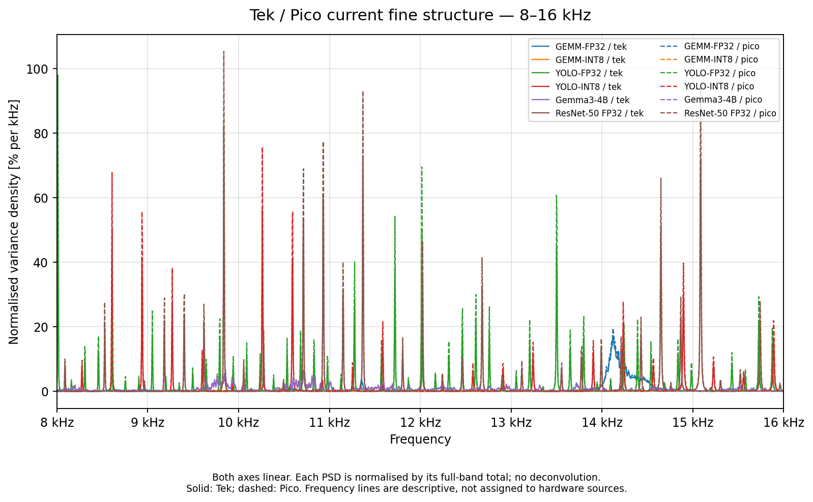

Quelle: `energy-measurement/evidence/spectra/sources/journal-psd/pico_vs_tek_psd/figures/fine_structure`

## current absolute psd

Originale Evidence / Zusatzprüfung; siehe Quellenzuordnung

[PDF](../sources/journal-psd/pico_vs_tek_psd/figures/per_workload/gemma3-4b/current_absolute_psd.pdf) · [PNG](../sources/journal-psd/pico_vs_tek_psd/figures/per_workload/gemma3-4b/current_absolute_psd.png)

Vorschau öffnen

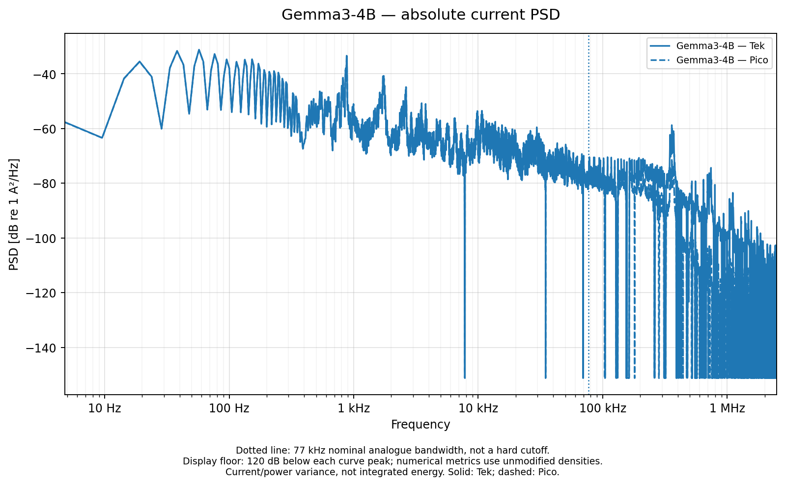

Quelle: `energy-measurement/evidence/spectra/sources/journal-psd/pico_vs_tek_psd/figures/per_workload/gemma3-4b`

## current cumulative

Originale Evidence / Zusatzprüfung; siehe Quellenzuordnung

[PDF](../sources/journal-psd/pico_vs_tek_psd/figures/per_workload/gemma3-4b/current_cumulative.pdf) · [PNG](../sources/journal-psd/pico_vs_tek_psd/figures/per_workload/gemma3-4b/current_cumulative.png)

Vorschau öffnen

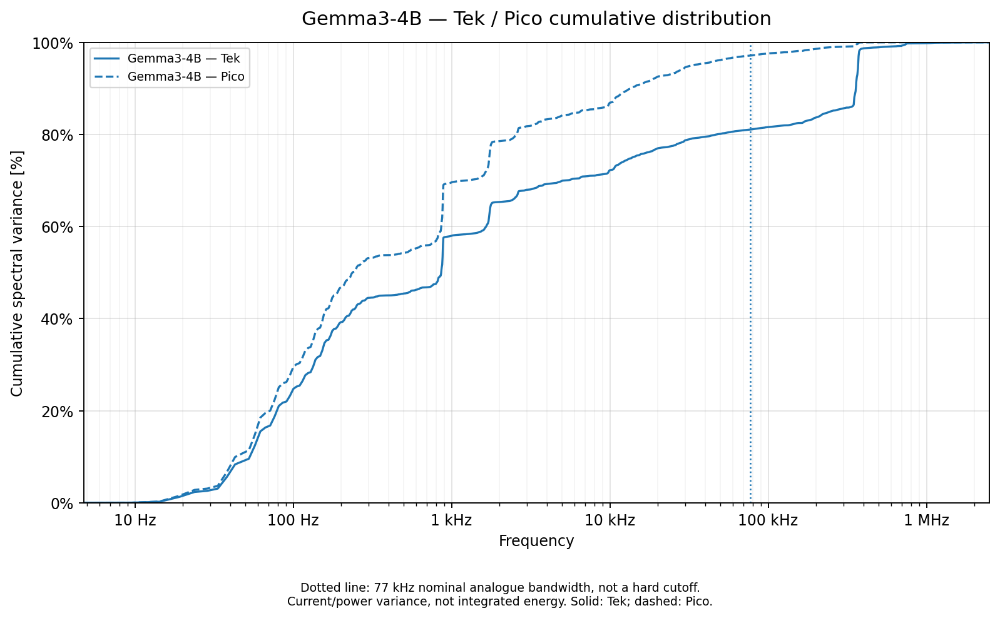

Quelle: `energy-measurement/evidence/spectra/sources/journal-psd/pico_vs_tek_psd/figures/per_workload/gemma3-4b`

## power absolute psd

Originale Evidence / Zusatzprüfung; siehe Quellenzuordnung

[PDF](../sources/journal-psd/pico_vs_tek_psd/figures/per_workload/gemma3-4b/power_absolute_psd.pdf) · [PNG](../sources/journal-psd/pico_vs_tek_psd/figures/per_workload/gemma3-4b/power_absolute_psd.png)

Vorschau öffnen

Quelle: `energy-measurement/evidence/spectra/sources/journal-psd/pico_vs_tek_psd/figures/per_workload/gemma3-4b`

## power cumulative

Originale Evidence / Zusatzprüfung; siehe Quellenzuordnung

[PDF](../sources/journal-psd/pico_vs_tek_psd/figures/per_workload/gemma3-4b/power_cumulative.pdf) · [PNG](../sources/journal-psd/pico_vs_tek_psd/figures/per_workload/gemma3-4b/power_cumulative.png)

Vorschau öffnen

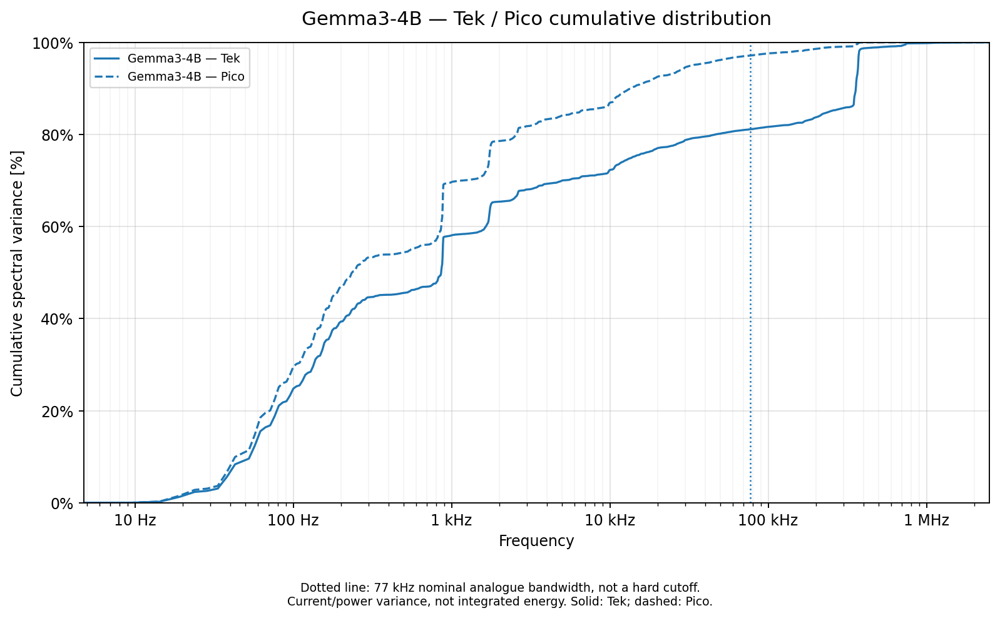

Quelle: `energy-measurement/evidence/spectra/sources/journal-psd/pico_vs_tek_psd/figures/per_workload/gemma3-4b`

## current absolute psd

Originale Evidence / Zusatzprüfung; siehe Quellenzuordnung

[PDF](../sources/journal-psd/pico_vs_tek_psd/figures/per_workload/gemmfp32/current_absolute_psd.pdf) · [PNG](../sources/journal-psd/pico_vs_tek_psd/figures/per_workload/gemmfp32/current_absolute_psd.png)

Vorschau öffnen

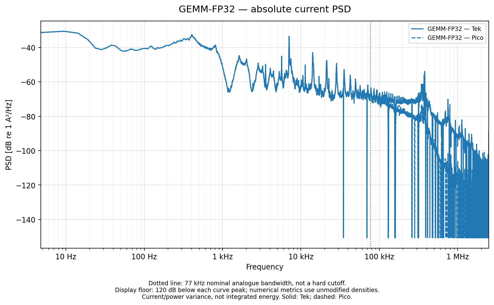

Quelle: `energy-measurement/evidence/spectra/sources/journal-psd/pico_vs_tek_psd/figures/per_workload/gemmfp32`

## current cumulative

Originale Evidence / Zusatzprüfung; siehe Quellenzuordnung

[PDF](../sources/journal-psd/pico_vs_tek_psd/figures/per_workload/gemmfp32/current_cumulative.pdf) · [PNG](../sources/journal-psd/pico_vs_tek_psd/figures/per_workload/gemmfp32/current_cumulative.png)

Vorschau öffnen

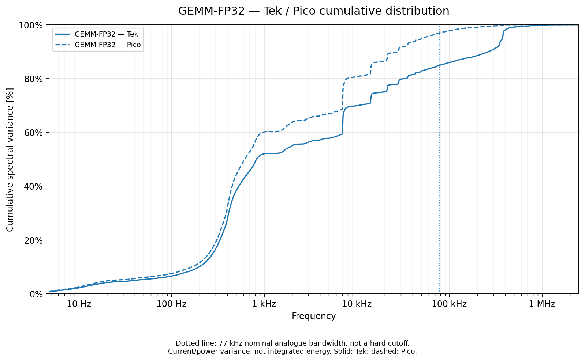

Quelle: `energy-measurement/evidence/spectra/sources/journal-psd/pico_vs_tek_psd/figures/per_workload/gemmfp32`

## power absolute psd

Originale Evidence / Zusatzprüfung; siehe Quellenzuordnung

[PDF](../sources/journal-psd/pico_vs_tek_psd/figures/per_workload/gemmfp32/power_absolute_psd.pdf) · [PNG](../sources/journal-psd/pico_vs_tek_psd/figures/per_workload/gemmfp32/power_absolute_psd.png)

Vorschau öffnen

Quelle: `energy-measurement/evidence/spectra/sources/journal-psd/pico_vs_tek_psd/figures/per_workload/gemmfp32`

## power cumulative

Originale Evidence / Zusatzprüfung; siehe Quellenzuordnung

[PDF](../sources/journal-psd/pico_vs_tek_psd/figures/per_workload/gemmfp32/power_cumulative.pdf) · [PNG](../sources/journal-psd/pico_vs_tek_psd/figures/per_workload/gemmfp32/power_cumulative.png)

Vorschau öffnen

Quelle: `energy-measurement/evidence/spectra/sources/journal-psd/pico_vs_tek_psd/figures/per_workload/gemmfp32`

## current absolute psd

Originale Evidence / Zusatzprüfung; siehe Quellenzuordnung

[PDF](../sources/journal-psd/pico_vs_tek_psd/figures/per_workload/gemmint8/current_absolute_psd.pdf) · [PNG](../sources/journal-psd/pico_vs_tek_psd/figures/per_workload/gemmint8/current_absolute_psd.png)

Vorschau öffnen

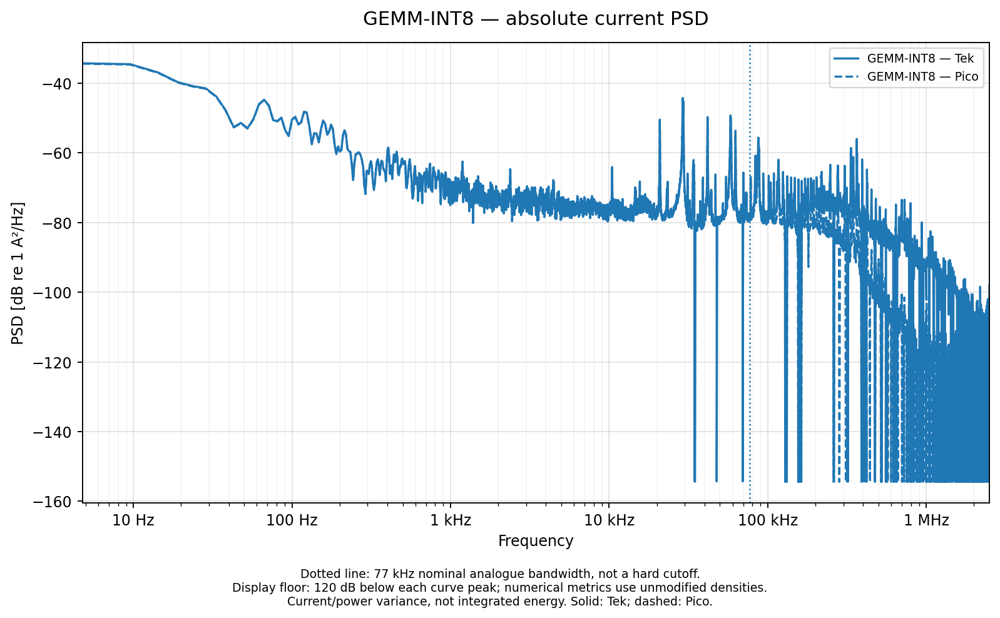

Quelle: `energy-measurement/evidence/spectra/sources/journal-psd/pico_vs_tek_psd/figures/per_workload/gemmint8`

## current cumulative

Originale Evidence / Zusatzprüfung; siehe Quellenzuordnung

[PDF](../sources/journal-psd/pico_vs_tek_psd/figures/per_workload/gemmint8/current_cumulative.pdf) · [PNG](../sources/journal-psd/pico_vs_tek_psd/figures/per_workload/gemmint8/current_cumulative.png)

Vorschau öffnen

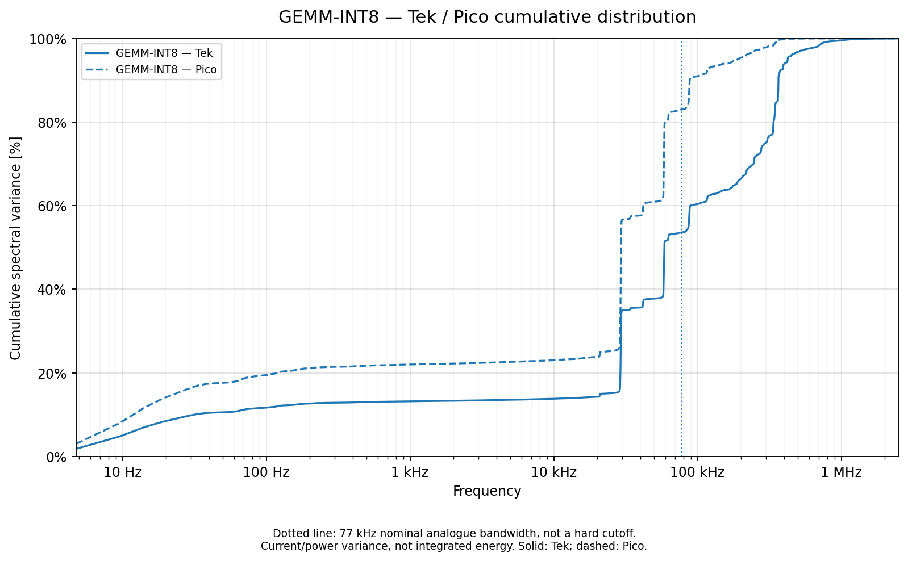

Quelle: `energy-measurement/evidence/spectra/sources/journal-psd/pico_vs_tek_psd/figures/per_workload/gemmint8`

## power absolute psd

Originale Evidence / Zusatzprüfung; siehe Quellenzuordnung

[PDF](../sources/journal-psd/pico_vs_tek_psd/figures/per_workload/gemmint8/power_absolute_psd.pdf) · [PNG](../sources/journal-psd/pico_vs_tek_psd/figures/per_workload/gemmint8/power_absolute_psd.png)

Vorschau öffnen

Quelle: `energy-measurement/evidence/spectra/sources/journal-psd/pico_vs_tek_psd/figures/per_workload/gemmint8`

## power cumulative

Originale Evidence / Zusatzprüfung; siehe Quellenzuordnung

[PDF](../sources/journal-psd/pico_vs_tek_psd/figures/per_workload/gemmint8/power_cumulative.pdf) · [PNG](../sources/journal-psd/pico_vs_tek_psd/figures/per_workload/gemmint8/power_cumulative.png)

Vorschau öffnen

Quelle: `energy-measurement/evidence/spectra/sources/journal-psd/pico_vs_tek_psd/figures/per_workload/gemmint8`

## current absolute psd

Originale Evidence / Zusatzprüfung; siehe Quellenzuordnung

[PDF](../sources/journal-psd/pico_vs_tek_psd/figures/per_workload/resnet50/current_absolute_psd.pdf) · [PNG](../sources/journal-psd/pico_vs_tek_psd/figures/per_workload/resnet50/current_absolute_psd.png)

Vorschau öffnen

Quelle: `energy-measurement/evidence/spectra/sources/journal-psd/pico_vs_tek_psd/figures/per_workload/resnet50`

## current cumulative

Originale Evidence / Zusatzprüfung; siehe Quellenzuordnung

[PDF](../sources/journal-psd/pico_vs_tek_psd/figures/per_workload/resnet50/current_cumulative.pdf) · [PNG](../sources/journal-psd/pico_vs_tek_psd/figures/per_workload/resnet50/current_cumulative.png)

Vorschau öffnen

Quelle: `energy-measurement/evidence/spectra/sources/journal-psd/pico_vs_tek_psd/figures/per_workload/resnet50`

## power absolute psd

Originale Evidence / Zusatzprüfung; siehe Quellenzuordnung

[PDF](../sources/journal-psd/pico_vs_tek_psd/figures/per_workload/resnet50/power_absolute_psd.pdf) · [PNG](../sources/journal-psd/pico_vs_tek_psd/figures/per_workload/resnet50/power_absolute_psd.png)

Vorschau öffnen

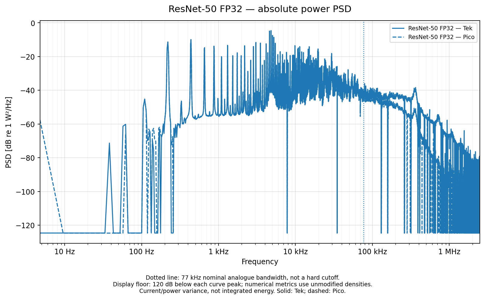

Quelle: `energy-measurement/evidence/spectra/sources/journal-psd/pico_vs_tek_psd/figures/per_workload/resnet50`

## power cumulative

Originale Evidence / Zusatzprüfung; siehe Quellenzuordnung

[PDF](../sources/journal-psd/pico_vs_tek_psd/figures/per_workload/resnet50/power_cumulative.pdf) · [PNG](../sources/journal-psd/pico_vs_tek_psd/figures/per_workload/resnet50/power_cumulative.png)

Vorschau öffnen

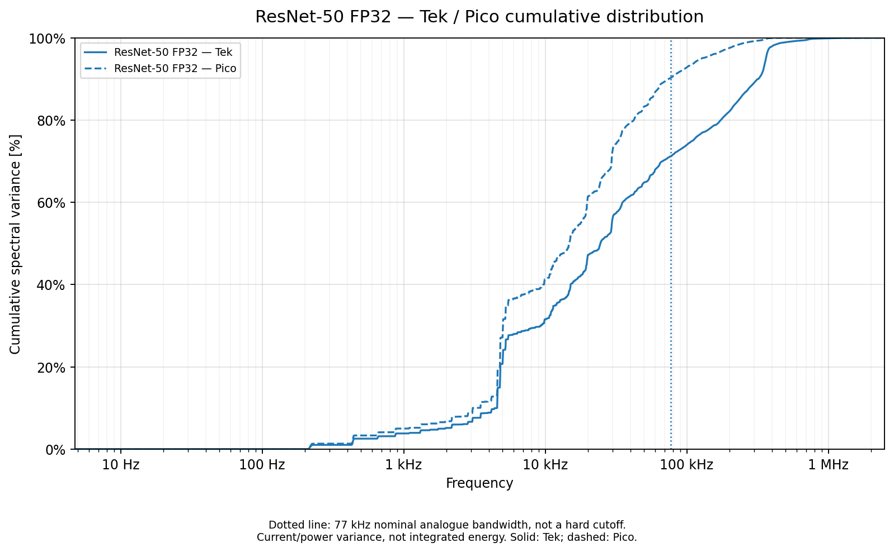

Quelle: `energy-measurement/evidence/spectra/sources/journal-psd/pico_vs_tek_psd/figures/per_workload/resnet50`

## current absolute psd

Originale Evidence / Zusatzprüfung; siehe Quellenzuordnung

[PDF](../sources/journal-psd/pico_vs_tek_psd/figures/per_workload/yolofp32/current_absolute_psd.pdf) · [PNG](../sources/journal-psd/pico_vs_tek_psd/figures/per_workload/yolofp32/current_absolute_psd.png)

Vorschau öffnen

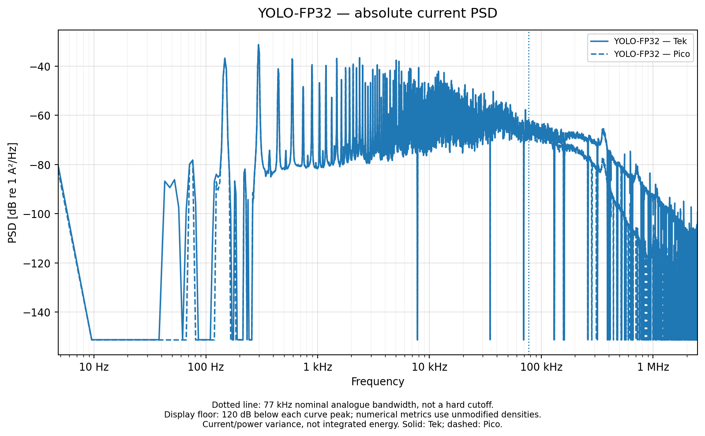

Quelle: `energy-measurement/evidence/spectra/sources/journal-psd/pico_vs_tek_psd/figures/per_workload/yolofp32`

## current cumulative

Originale Evidence / Zusatzprüfung; siehe Quellenzuordnung

[PDF](../sources/journal-psd/pico_vs_tek_psd/figures/per_workload/yolofp32/current_cumulative.pdf) · [PNG](../sources/journal-psd/pico_vs_tek_psd/figures/per_workload/yolofp32/current_cumulative.png)

Vorschau öffnen

Quelle: `energy-measurement/evidence/spectra/sources/journal-psd/pico_vs_tek_psd/figures/per_workload/yolofp32`

## power absolute psd

Originale Evidence / Zusatzprüfung; siehe Quellenzuordnung

[PDF](../sources/journal-psd/pico_vs_tek_psd/figures/per_workload/yolofp32/power_absolute_psd.pdf) · [PNG](../sources/journal-psd/pico_vs_tek_psd/figures/per_workload/yolofp32/power_absolute_psd.png)

Vorschau öffnen

Quelle: `energy-measurement/evidence/spectra/sources/journal-psd/pico_vs_tek_psd/figures/per_workload/yolofp32`

## power cumulative

Originale Evidence / Zusatzprüfung; siehe Quellenzuordnung

[PDF](../sources/journal-psd/pico_vs_tek_psd/figures/per_workload/yolofp32/power_cumulative.pdf) · [PNG](../sources/journal-psd/pico_vs_tek_psd/figures/per_workload/yolofp32/power_cumulative.png)

Vorschau öffnen

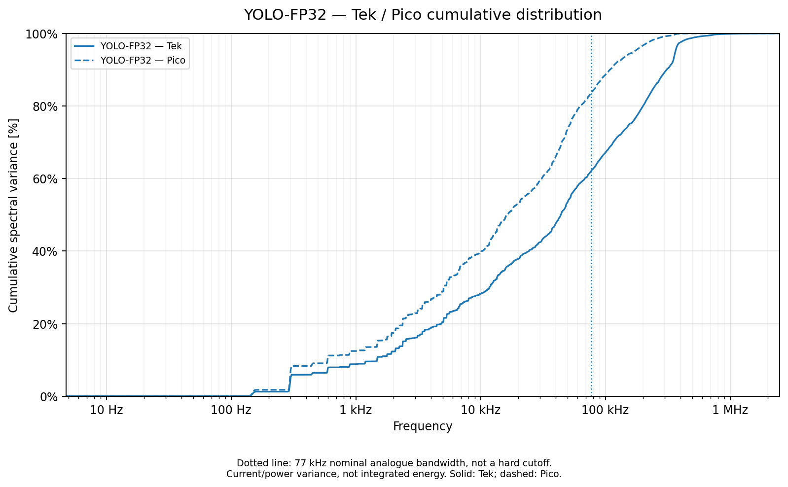

Quelle: `energy-measurement/evidence/spectra/sources/journal-psd/pico_vs_tek_psd/figures/per_workload/yolofp32`

## current absolute psd

Originale Evidence / Zusatzprüfung; siehe Quellenzuordnung

[PDF](../sources/journal-psd/pico_vs_tek_psd/figures/per_workload/yoloint8/current_absolute_psd.pdf) · [PNG](../sources/journal-psd/pico_vs_tek_psd/figures/per_workload/yoloint8/current_absolute_psd.png)

Vorschau öffnen

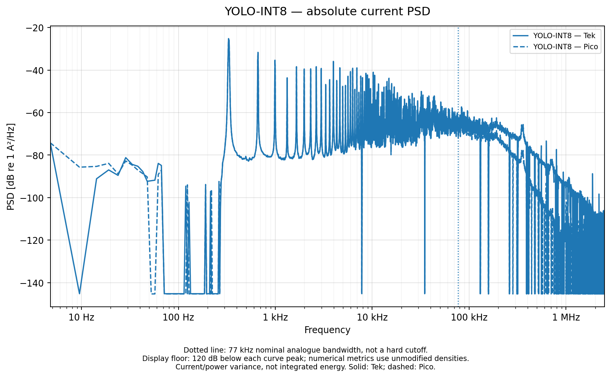

Quelle: `energy-measurement/evidence/spectra/sources/journal-psd/pico_vs_tek_psd/figures/per_workload/yoloint8`

## current cumulative

Originale Evidence / Zusatzprüfung; siehe Quellenzuordnung

[PDF](../sources/journal-psd/pico_vs_tek_psd/figures/per_workload/yoloint8/current_cumulative.pdf) · [PNG](../sources/journal-psd/pico_vs_tek_psd/figures/per_workload/yoloint8/current_cumulative.png)

Vorschau öffnen

Quelle: `energy-measurement/evidence/spectra/sources/journal-psd/pico_vs_tek_psd/figures/per_workload/yoloint8`

## power absolute psd

Originale Evidence / Zusatzprüfung; siehe Quellenzuordnung

[PDF](../sources/journal-psd/pico_vs_tek_psd/figures/per_workload/yoloint8/power_absolute_psd.pdf) · [PNG](../sources/journal-psd/pico_vs_tek_psd/figures/per_workload/yoloint8/power_absolute_psd.png)

Vorschau öffnen

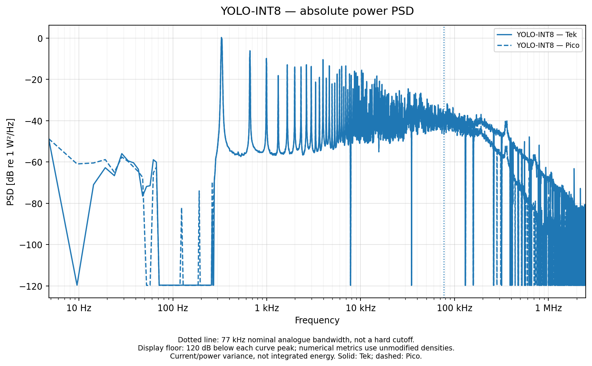

Quelle: `energy-measurement/evidence/spectra/sources/journal-psd/pico_vs_tek_psd/figures/per_workload/yoloint8`

## power cumulative

Originale Evidence / Zusatzprüfung; siehe Quellenzuordnung

[PDF](../sources/journal-psd/pico_vs_tek_psd/figures/per_workload/yoloint8/power_cumulative.pdf) · [PNG](../sources/journal-psd/pico_vs_tek_psd/figures/per_workload/yoloint8/power_cumulative.png)

Vorschau öffnen

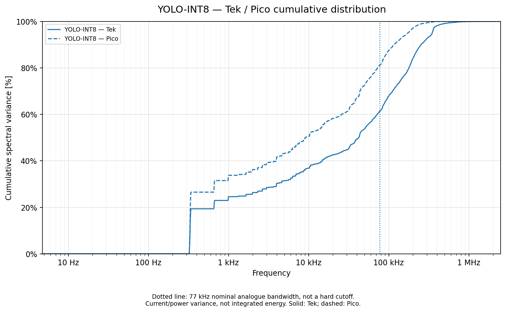

Quelle: `energy-measurement/evidence/spectra/sources/journal-psd/pico_vs_tek_psd/figures/per_workload/yoloint8`

## pico cross workload current cumulative

Originale Evidence / Zusatzprüfung; siehe Quellenzuordnung

[PDF](../sources/journal-psd/pico_vs_tek_psd/figures/pico_cross_workload_current_cumulative.pdf) · [PNG](../sources/journal-psd/pico_vs_tek_psd/figures/pico_cross_workload_current_cumulative.png)

Vorschau öffnen

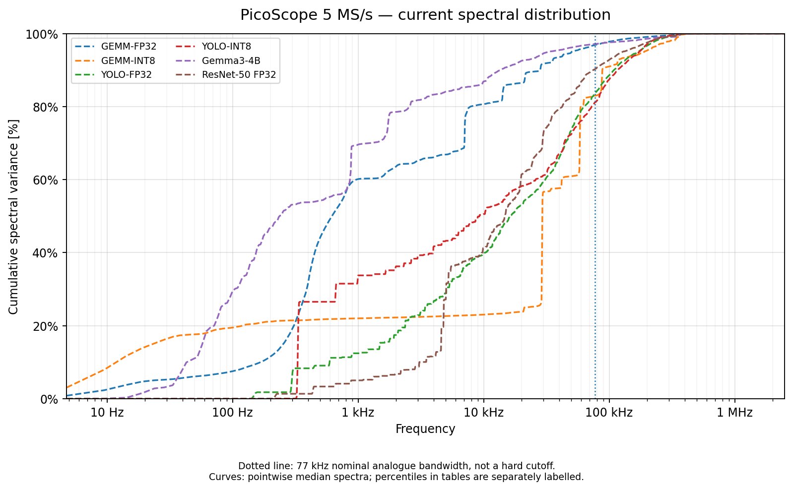

Quelle: `energy-measurement/evidence/spectra/sources/journal-psd/pico_vs_tek_psd/figures`

## pico cross workload current normalised psd

Originale Evidence / Zusatzprüfung; siehe Quellenzuordnung

[PDF](../sources/journal-psd/pico_vs_tek_psd/figures/pico_cross_workload_current_normalised_psd.pdf) · [PNG](../sources/journal-psd/pico_vs_tek_psd/figures/pico_cross_workload_current_normalised_psd.png)

Vorschau öffnen

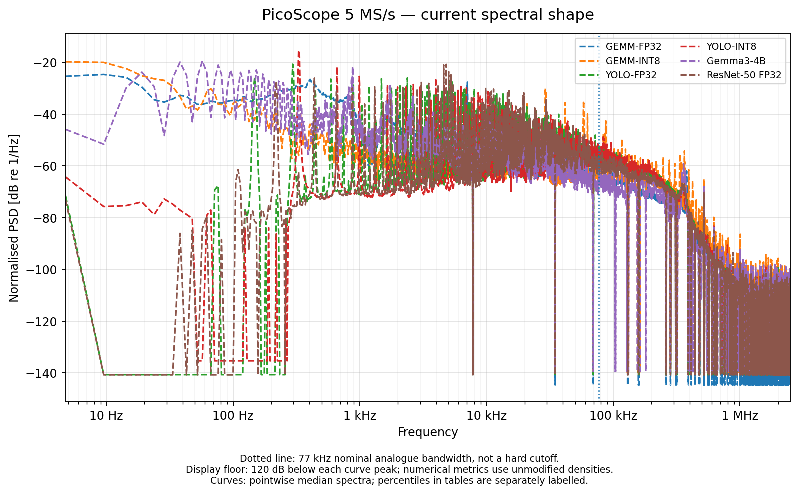

Quelle: `energy-measurement/evidence/spectra/sources/journal-psd/pico_vs_tek_psd/figures`

## pico cross workload power cumulative

Originale Evidence / Zusatzprüfung; siehe Quellenzuordnung

[PDF](../sources/journal-psd/pico_vs_tek_psd/figures/pico_cross_workload_power_cumulative.pdf) · [PNG](../sources/journal-psd/pico_vs_tek_psd/figures/pico_cross_workload_power_cumulative.png)

Vorschau öffnen

Quelle: `energy-measurement/evidence/spectra/sources/journal-psd/pico_vs_tek_psd/figures`

## pico cross workload power normalised psd

Originale Evidence / Zusatzprüfung; siehe Quellenzuordnung

[PDF](../sources/journal-psd/pico_vs_tek_psd/figures/pico_cross_workload_power_normalised_psd.pdf) · [PNG](../sources/journal-psd/pico_vs_tek_psd/figures/pico_cross_workload_power_normalised_psd.png)

Vorschau öffnen

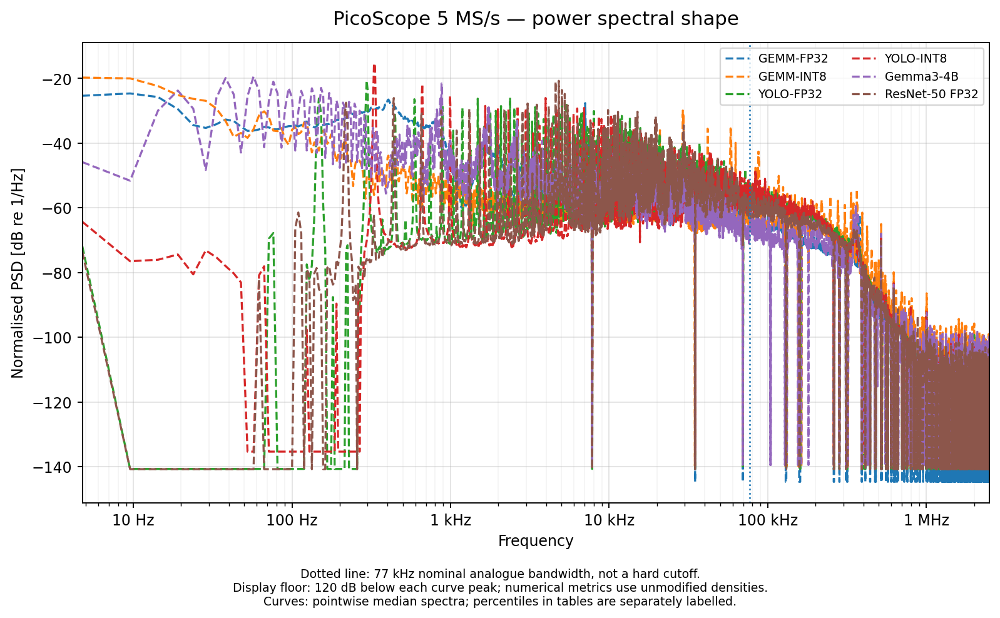

Quelle: `energy-measurement/evidence/spectra/sources/journal-psd/pico_vs_tek_psd/figures`

## pico current frequency bands

Originale Evidence / Zusatzprüfung; siehe Quellenzuordnung

[PDF](../sources/journal-psd/pico_vs_tek_psd/figures/pico_current_frequency_bands.pdf) · [PNG](../sources/journal-psd/pico_vs_tek_psd/figures/pico_current_frequency_bands.png)

Vorschau öffnen

Quelle: `energy-measurement/evidence/spectra/sources/journal-psd/pico_vs_tek_psd/figures`

## pico power frequency bands

Originale Evidence / Zusatzprüfung; siehe Quellenzuordnung

[PDF](../sources/journal-psd/pico_vs_tek_psd/figures/pico_power_frequency_bands.pdf) · [PNG](../sources/journal-psd/pico_vs_tek_psd/figures/pico_power_frequency_bands.png)

Vorschau öffnen

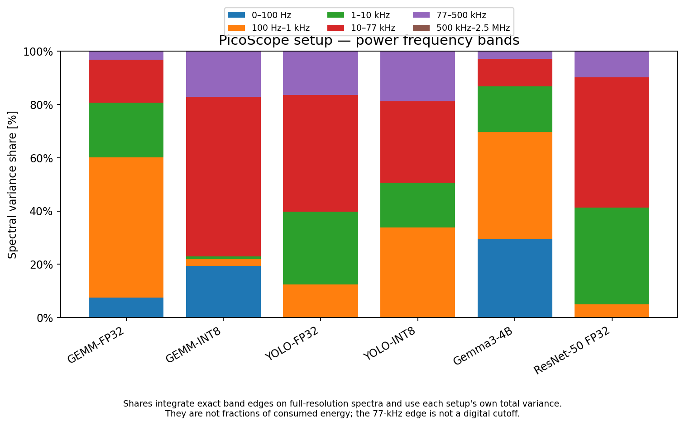

Quelle: `energy-measurement/evidence/spectra/sources/journal-psd/pico_vs_tek_psd/figures`

## tek vs pico current conditional cumulative 0 77khz

Originale Evidence / Zusatzprüfung; siehe Quellenzuordnung

[PDF](../sources/journal-psd/pico_vs_tek_psd/figures/tek_vs_pico_current_conditional_cumulative_0_77khz.pdf) · [PNG](../sources/journal-psd/pico_vs_tek_psd/figures/tek_vs_pico_current_conditional_cumulative_0_77khz.png)

Vorschau öffnen

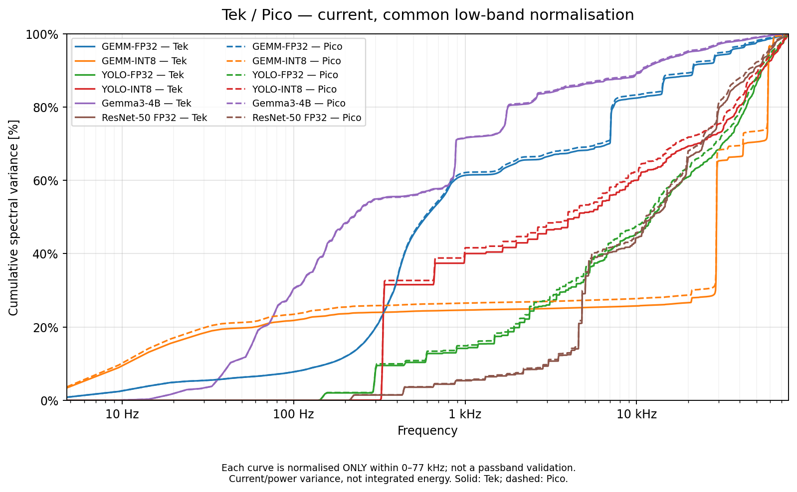

Quelle: `energy-measurement/evidence/spectra/sources/journal-psd/pico_vs_tek_psd/figures`

## tek vs pico current cumulative difference

Originale Evidence / Zusatzprüfung; siehe Quellenzuordnung

[PDF](../sources/journal-psd/pico_vs_tek_psd/figures/tek_vs_pico_current_cumulative_difference.pdf) · [PNG](../sources/journal-psd/pico_vs_tek_psd/figures/tek_vs_pico_current_cumulative_difference.png)

Vorschau öffnen

Quelle: `energy-measurement/evidence/spectra/sources/journal-psd/pico_vs_tek_psd/figures`

## tek vs pico current cumulative overlay

Originale Evidence / Zusatzprüfung; siehe Quellenzuordnung

[PDF](../sources/journal-psd/pico_vs_tek_psd/figures/tek_vs_pico_current_cumulative_overlay.pdf) · [PNG](../sources/journal-psd/pico_vs_tek_psd/figures/tek_vs_pico_current_cumulative_overlay.png)

Vorschau öffnen

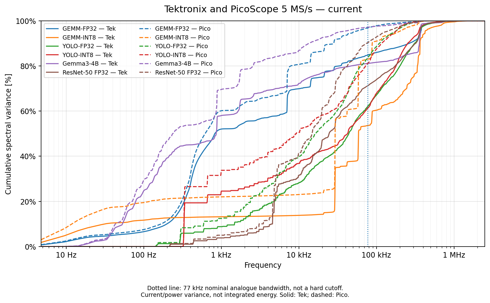

Quelle: `energy-measurement/evidence/spectra/sources/journal-psd/pico_vs_tek_psd/figures`

## tek vs pico current f50

Originale Evidence / Zusatzprüfung; siehe Quellenzuordnung

[PDF](../sources/journal-psd/pico_vs_tek_psd/figures/tek_vs_pico_current_f50.pdf) · [PNG](../sources/journal-psd/pico_vs_tek_psd/figures/tek_vs_pico_current_f50.png)

Vorschau öffnen

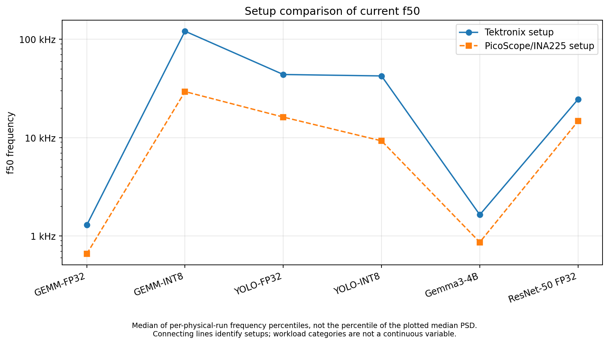

Quelle: `energy-measurement/evidence/spectra/sources/journal-psd/pico_vs_tek_psd/figures`

## tek vs pico current f90

Originale Evidence / Zusatzprüfung; siehe Quellenzuordnung

[PDF](../sources/journal-psd/pico_vs_tek_psd/figures/tek_vs_pico_current_f90.pdf) · [PNG](../sources/journal-psd/pico_vs_tek_psd/figures/tek_vs_pico_current_f90.png)

Vorschau öffnen

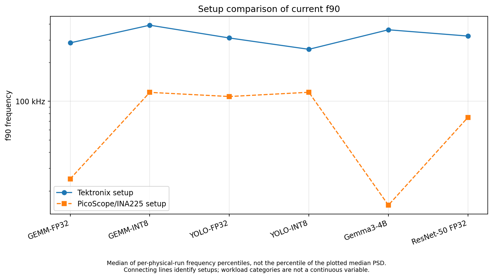

Quelle: `energy-measurement/evidence/spectra/sources/journal-psd/pico_vs_tek_psd/figures`

## tek vs pico current f95

Originale Evidence / Zusatzprüfung; siehe Quellenzuordnung

[PDF](../sources/journal-psd/pico_vs_tek_psd/figures/tek_vs_pico_current_f95.pdf) · [PNG](../sources/journal-psd/pico_vs_tek_psd/figures/tek_vs_pico_current_f95.png)

Vorschau öffnen

Quelle: `energy-measurement/evidence/spectra/sources/journal-psd/pico_vs_tek_psd/figures`

## tek vs pico current f99

Originale Evidence / Zusatzprüfung; siehe Quellenzuordnung

[PDF](../sources/journal-psd/pico_vs_tek_psd/figures/tek_vs_pico_current_f99.pdf) · [PNG](../sources/journal-psd/pico_vs_tek_psd/figures/tek_vs_pico_current_f99.png)

Vorschau öffnen

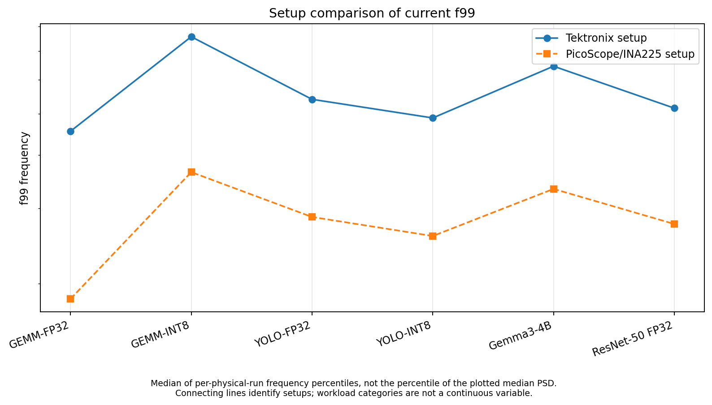

Quelle: `energy-measurement/evidence/spectra/sources/journal-psd/pico_vs_tek_psd/figures`

## tek vs pico current normalised psd overlay

Originale Evidence / Zusatzprüfung; siehe Quellenzuordnung

[PDF](../sources/journal-psd/pico_vs_tek_psd/figures/tek_vs_pico_current_normalised_psd_overlay.pdf) · [PNG](../sources/journal-psd/pico_vs_tek_psd/figures/tek_vs_pico_current_normalised_psd_overlay.png)

Vorschau öffnen

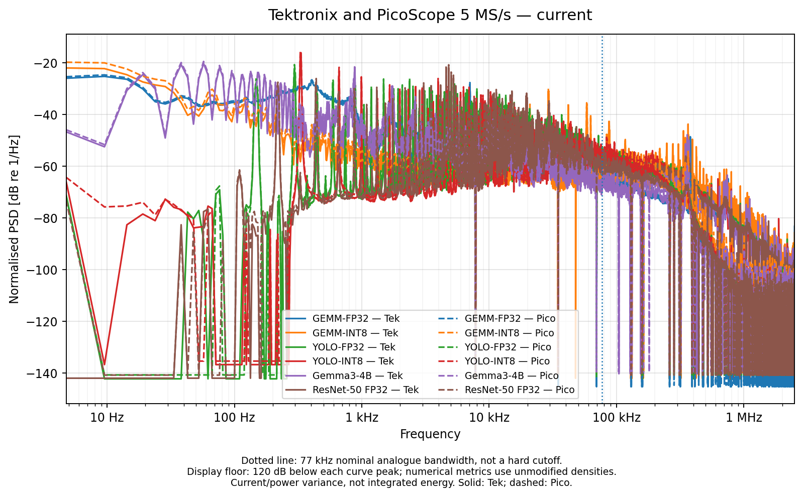

Quelle: `energy-measurement/evidence/spectra/sources/journal-psd/pico_vs_tek_psd/figures`

## tek vs pico current observed psd ratio

Originale Evidence / Zusatzprüfung; siehe Quellenzuordnung

[PDF](../sources/journal-psd/pico_vs_tek_psd/figures/tek_vs_pico_current_observed_psd_ratio.pdf) · [PNG](../sources/journal-psd/pico_vs_tek_psd/figures/tek_vs_pico_current_observed_psd_ratio.png)

Vorschau öffnen

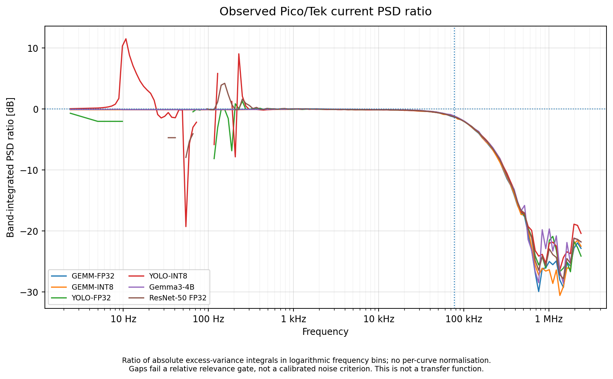

Quelle: `energy-measurement/evidence/spectra/sources/journal-psd/pico_vs_tek_psd/figures`

## tek vs pico power conditional cumulative 0 77khz

Originale Evidence / Zusatzprüfung; siehe Quellenzuordnung

[PDF](../sources/journal-psd/pico_vs_tek_psd/figures/tek_vs_pico_power_conditional_cumulative_0_77khz.pdf) · [PNG](../sources/journal-psd/pico_vs_tek_psd/figures/tek_vs_pico_power_conditional_cumulative_0_77khz.png)

Vorschau öffnen

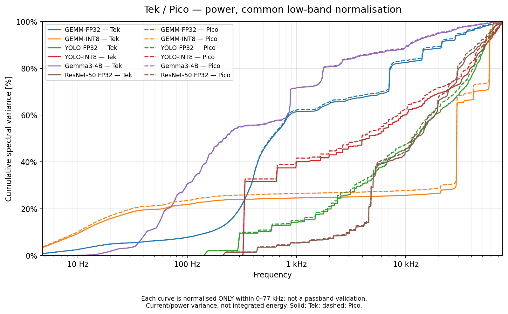

Quelle: `energy-measurement/evidence/spectra/sources/journal-psd/pico_vs_tek_psd/figures`

## tek vs pico power cumulative difference

Originale Evidence / Zusatzprüfung; siehe Quellenzuordnung

[PDF](../sources/journal-psd/pico_vs_tek_psd/figures/tek_vs_pico_power_cumulative_difference.pdf) · [PNG](../sources/journal-psd/pico_vs_tek_psd/figures/tek_vs_pico_power_cumulative_difference.png)

Vorschau öffnen

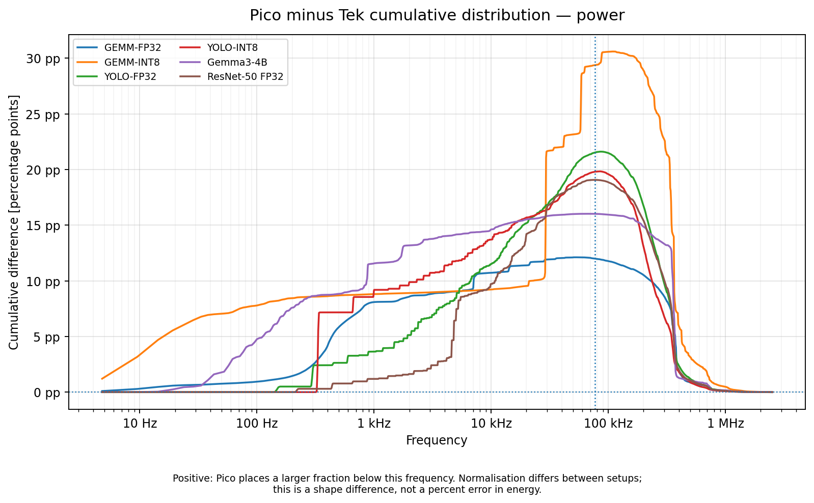

Quelle: `energy-measurement/evidence/spectra/sources/journal-psd/pico_vs_tek_psd/figures`

## tek vs pico power cumulative overlay

Originale Evidence / Zusatzprüfung; siehe Quellenzuordnung

[PDF](../sources/journal-psd/pico_vs_tek_psd/figures/tek_vs_pico_power_cumulative_overlay.pdf) · [PNG](../sources/journal-psd/pico_vs_tek_psd/figures/tek_vs_pico_power_cumulative_overlay.png)

Vorschau öffnen

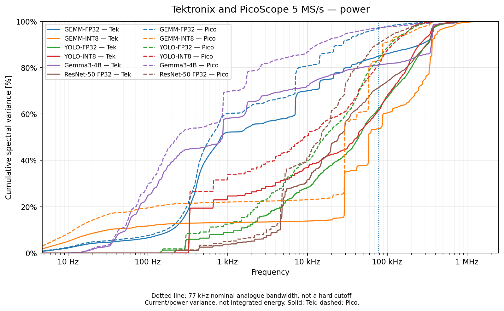

Quelle: `energy-measurement/evidence/spectra/sources/journal-psd/pico_vs_tek_psd/figures`

## tek vs pico power f50

Originale Evidence / Zusatzprüfung; siehe Quellenzuordnung

[PDF](../sources/journal-psd/pico_vs_tek_psd/figures/tek_vs_pico_power_f50.pdf) · [PNG](../sources/journal-psd/pico_vs_tek_psd/figures/tek_vs_pico_power_f50.png)

Vorschau öffnen

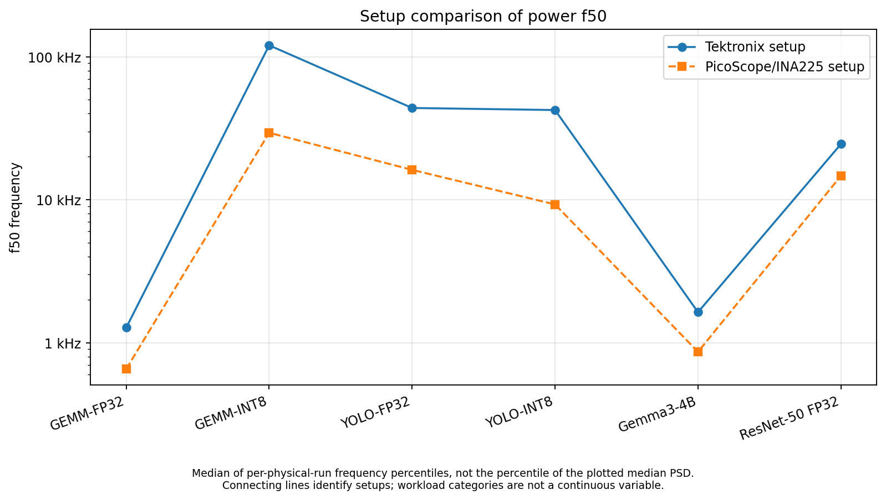

Quelle: `energy-measurement/evidence/spectra/sources/journal-psd/pico_vs_tek_psd/figures`

## tek vs pico power f90

Originale Evidence / Zusatzprüfung; siehe Quellenzuordnung

[PDF](../sources/journal-psd/pico_vs_tek_psd/figures/tek_vs_pico_power_f90.pdf) · [PNG](../sources/journal-psd/pico_vs_tek_psd/figures/tek_vs_pico_power_f90.png)

Vorschau öffnen

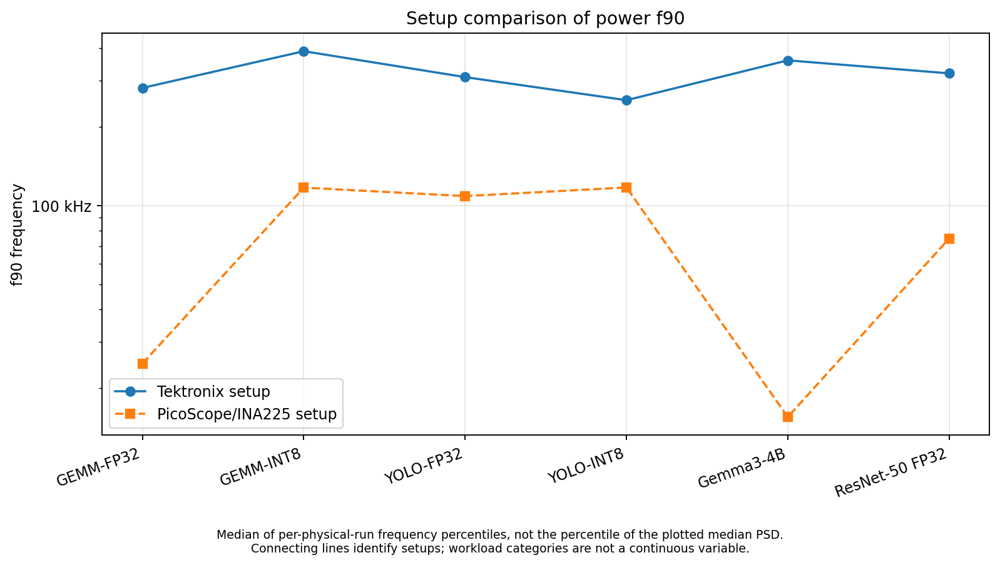

Quelle: `energy-measurement/evidence/spectra/sources/journal-psd/pico_vs_tek_psd/figures`

## tek vs pico power f95

Originale Evidence / Zusatzprüfung; siehe Quellenzuordnung

[PDF](../sources/journal-psd/pico_vs_tek_psd/figures/tek_vs_pico_power_f95.pdf) · [PNG](../sources/journal-psd/pico_vs_tek_psd/figures/tek_vs_pico_power_f95.png)

Vorschau öffnen

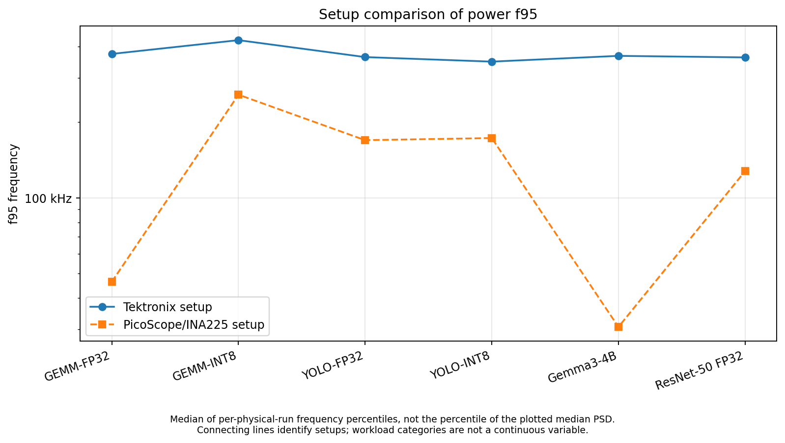

Quelle: `energy-measurement/evidence/spectra/sources/journal-psd/pico_vs_tek_psd/figures`

## tek vs pico power f99

Originale Evidence / Zusatzprüfung; siehe Quellenzuordnung

[PDF](../sources/journal-psd/pico_vs_tek_psd/figures/tek_vs_pico_power_f99.pdf) · [PNG](../sources/journal-psd/pico_vs_tek_psd/figures/tek_vs_pico_power_f99.png)

Vorschau öffnen

Quelle: `energy-measurement/evidence/spectra/sources/journal-psd/pico_vs_tek_psd/figures`

## tek vs pico power normalised psd overlay

Originale Evidence / Zusatzprüfung; siehe Quellenzuordnung

[PDF](../sources/journal-psd/pico_vs_tek_psd/figures/tek_vs_pico_power_normalised_psd_overlay.pdf) · [PNG](../sources/journal-psd/pico_vs_tek_psd/figures/tek_vs_pico_power_normalised_psd_overlay.png)

Vorschau öffnen

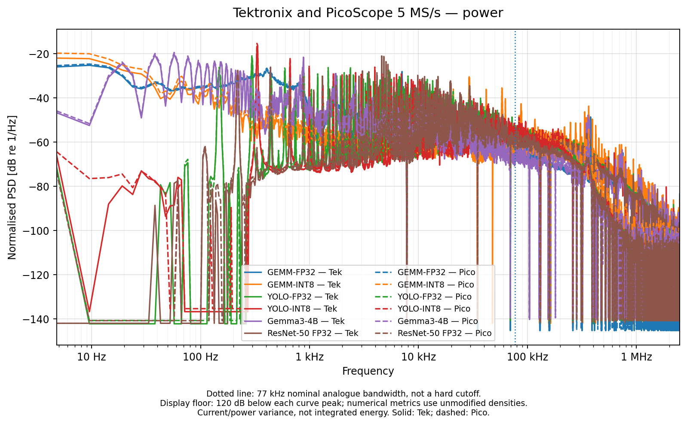

Quelle: `energy-measurement/evidence/spectra/sources/journal-psd/pico_vs_tek_psd/figures`

## tek vs pico power observed psd ratio

Originale Evidence / Zusatzprüfung; siehe Quellenzuordnung

[PDF](../sources/journal-psd/pico_vs_tek_psd/figures/tek_vs_pico_power_observed_psd_ratio.pdf) · [PNG](../sources/journal-psd/pico_vs_tek_psd/figures/tek_vs_pico_power_observed_psd_ratio.png)

Vorschau öffnen

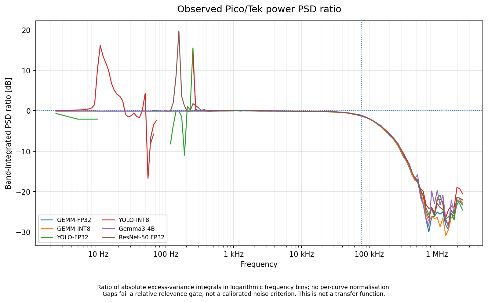

Quelle: `energy-measurement/evidence/spectra/sources/journal-psd/pico_vs_tek_psd/figures`
