# Abbildungen: spectra--multi-workload-psd

[Zurück](README.md)

**Einordnung:** Originale Evidence / Zusatzprüfung.

## cross workload active idle psd paper

Originale Evidence / Zusatzprüfung; siehe Quellenzuordnung

[PDF](../sources/multi-workload-psd/paper_artifacts/figures/cross_workload_active_idle_psd_paper.pdf) · [PNG](../sources/multi-workload-psd/paper_artifacts/figures/cross_workload_active_idle_psd_paper.png)

Vorschau öffnen

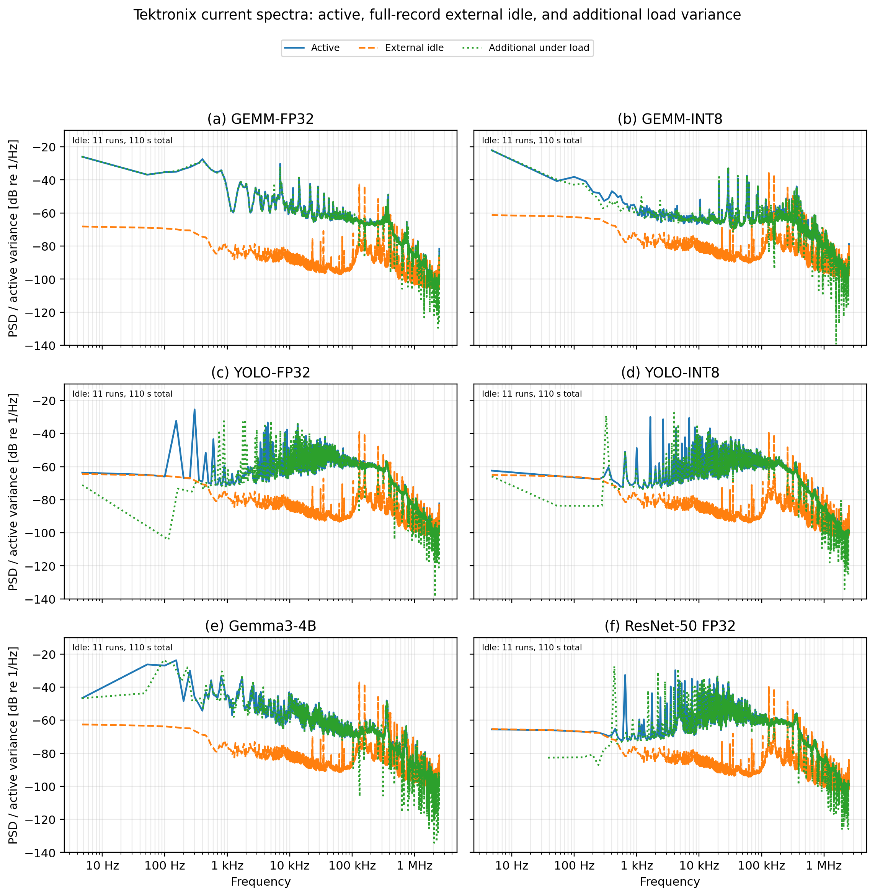

Quelle: `energy-measurement/evidence/spectra/sources/multi-workload-psd/paper_artifacts/figures`

## cross workload active idle ratio paper

Originale Evidence / Zusatzprüfung; siehe Quellenzuordnung

[PDF](../sources/multi-workload-psd/paper_artifacts/figures/cross_workload_active_idle_ratio_paper.pdf) · [PNG](../sources/multi-workload-psd/paper_artifacts/figures/cross_workload_active_idle_ratio_paper.png)

Vorschau öffnen

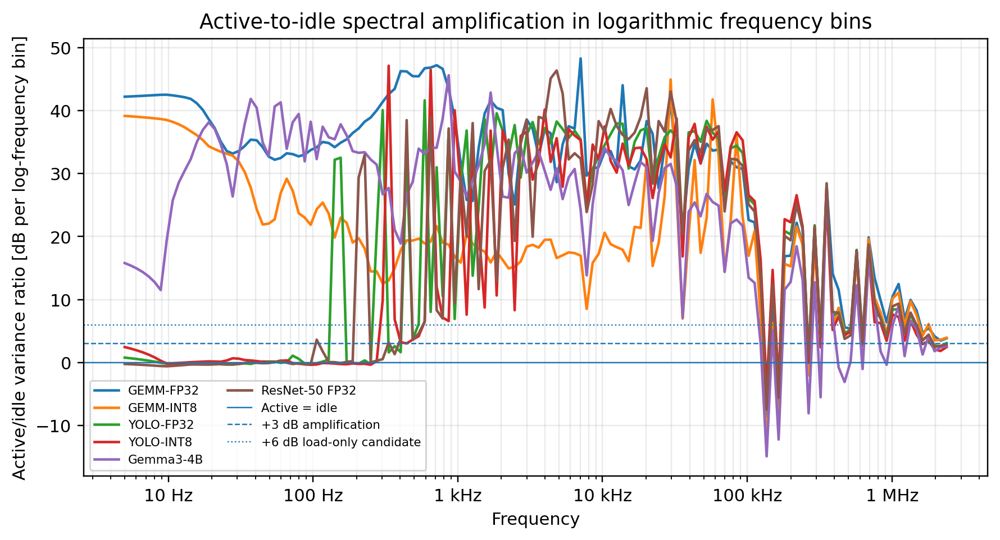

Quelle: `energy-measurement/evidence/spectra/sources/multi-workload-psd/paper_artifacts/figures`

## cross workload current psd paper

Originale Evidence / Zusatzprüfung; siehe Quellenzuordnung

[PDF](../sources/multi-workload-psd/paper_artifacts/figures/cross_workload_current_psd_paper.pdf) · [PNG](../sources/multi-workload-psd/paper_artifacts/figures/cross_workload_current_psd_paper.png)

Vorschau öffnen

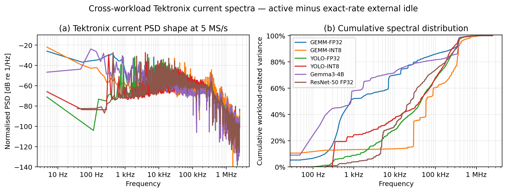

Quelle: `energy-measurement/evidence/spectra/sources/multi-workload-psd/paper_artifacts/figures`

## cross workload direct vs common reference paper

Originale Evidence / Zusatzprüfung; siehe Quellenzuordnung

[PDF](../sources/multi-workload-psd/paper_artifacts/figures/cross_workload_direct_vs_common_reference_paper.pdf) · [PNG](../sources/multi-workload-psd/paper_artifacts/figures/cross_workload_direct_vs_common_reference_paper.png)

Vorschau öffnen

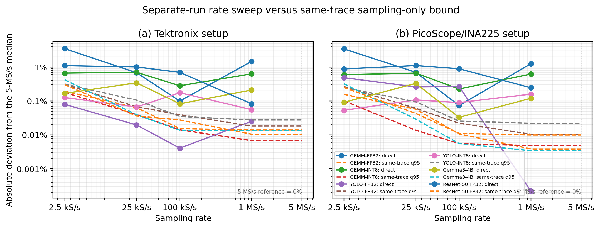

Quelle: `energy-measurement/evidence/spectra/sources/multi-workload-psd/paper_artifacts/figures`

## cross workload energy duration paper

Originale Evidence / Zusatzprüfung; siehe Quellenzuordnung

[PDF](../sources/multi-workload-psd/paper_artifacts/figures/cross_workload_energy_duration_paper.pdf) · [PNG](../sources/multi-workload-psd/paper_artifacts/figures/cross_workload_energy_duration_paper.png)

Vorschau öffnen

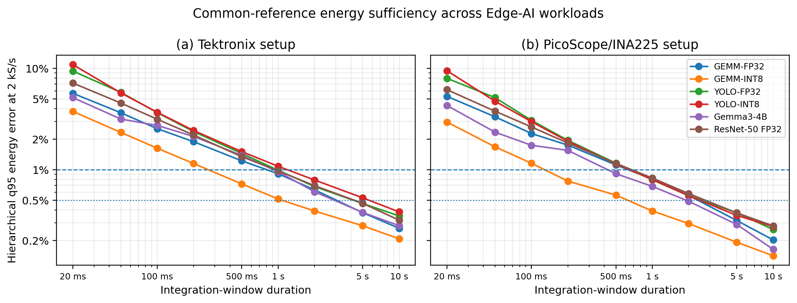

Quelle: `energy-measurement/evidence/spectra/sources/multi-workload-psd/paper_artifacts/figures`

## cross workload fmin paper

Originale Evidence / Zusatzprüfung; siehe Quellenzuordnung

[PDF](../sources/multi-workload-psd/paper_artifacts/figures/cross_workload_fmin_paper.pdf) · [PNG](../sources/multi-workload-psd/paper_artifacts/figures/cross_workload_fmin_paper.png)

Vorschau öffnen

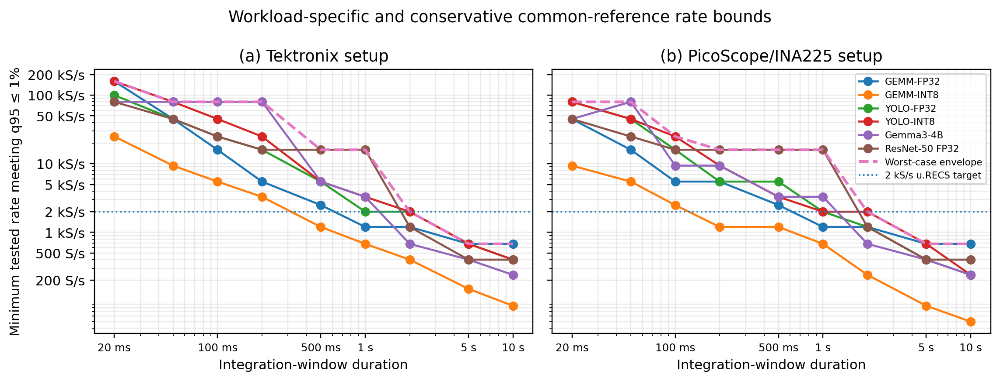

Quelle: `energy-measurement/evidence/spectra/sources/multi-workload-psd/paper_artifacts/figures`

## cross workload frequency bands paper

Originale Evidence / Zusatzprüfung; siehe Quellenzuordnung

[PDF](../sources/multi-workload-psd/paper_artifacts/figures/cross_workload_frequency_bands_paper.pdf) · [PNG](../sources/multi-workload-psd/paper_artifacts/figures/cross_workload_frequency_bands_paper.png)

Vorschau öffnen

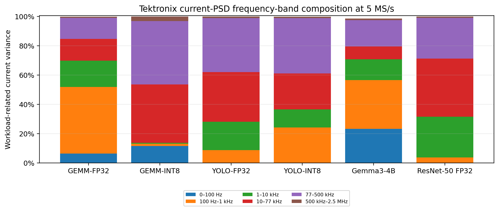

Quelle: `energy-measurement/evidence/spectra/sources/multi-workload-psd/paper_artifacts/figures`

## cross workload idle load frequency bands paper

Originale Evidence / Zusatzprüfung; siehe Quellenzuordnung

[PDF](../sources/multi-workload-psd/paper_artifacts/figures/cross_workload_idle_load_frequency_bands_paper.pdf) · [PNG](../sources/multi-workload-psd/paper_artifacts/figures/cross_workload_idle_load_frequency_bands_paper.png)

Vorschau öffnen

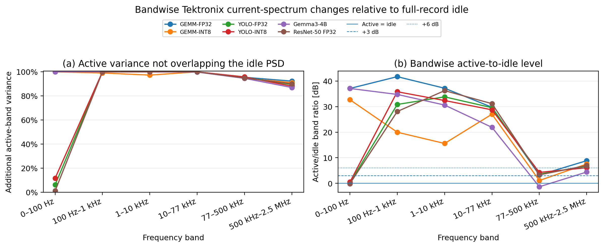

Quelle: `energy-measurement/evidence/spectra/sources/multi-workload-psd/paper_artifacts/figures`

## cross workload log frequency variance share paper

Originale Evidence / Zusatzprüfung; siehe Quellenzuordnung

[PDF](../sources/multi-workload-psd/paper_artifacts/figures/cross_workload_log_frequency_variance_share_paper.pdf) · [PNG](../sources/multi-workload-psd/paper_artifacts/figures/cross_workload_log_frequency_variance_share_paper.png)

Vorschau öffnen

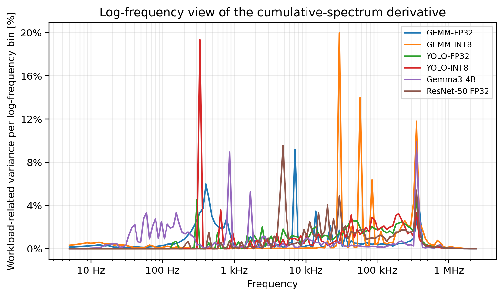

Quelle: `energy-measurement/evidence/spectra/sources/multi-workload-psd/paper_artifacts/figures`

## cross workload power psd paper

Originale Evidence / Zusatzprüfung; siehe Quellenzuordnung

[PDF](../sources/multi-workload-psd/paper_artifacts/figures/cross_workload_power_psd_paper.pdf) · [PNG](../sources/multi-workload-psd/paper_artifacts/figures/cross_workload_power_psd_paper.png)

Vorschau öffnen

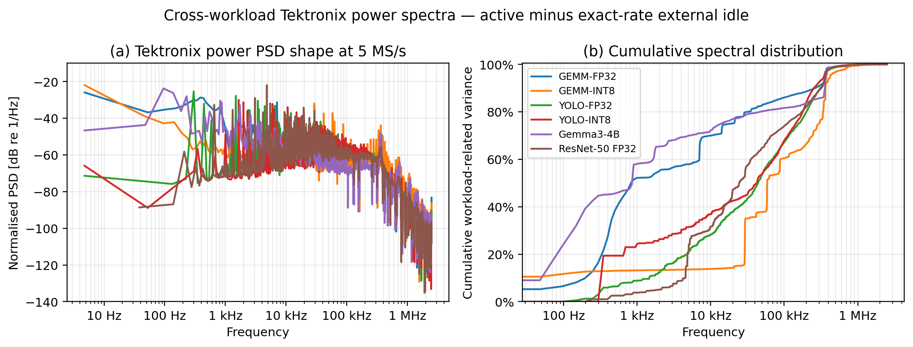

Quelle: `energy-measurement/evidence/spectra/sources/multi-workload-psd/paper_artifacts/figures`

## cross workload psd fine structure paper

Originale Evidence / Zusatzprüfung; siehe Quellenzuordnung

[PDF](../sources/multi-workload-psd/paper_artifacts/figures/cross_workload_psd_fine_structure_paper.pdf) · [PNG](../sources/multi-workload-psd/paper_artifacts/figures/cross_workload_psd_fine_structure_paper.png)

Vorschau öffnen

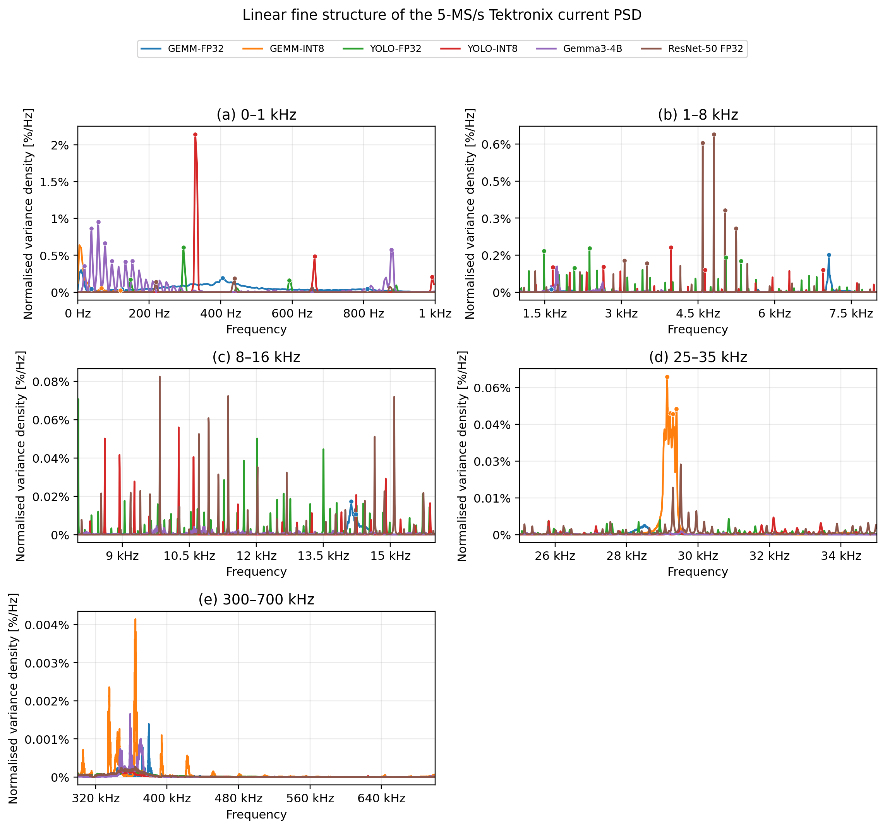

Quelle: `energy-measurement/evidence/spectra/sources/multi-workload-psd/paper_artifacts/figures`

## cross workload worst case envelope paper

Originale Evidence / Zusatzprüfung; siehe Quellenzuordnung

[PDF](../sources/multi-workload-psd/paper_artifacts/figures/cross_workload_worst_case_envelope_paper.pdf) · [PNG](../sources/multi-workload-psd/paper_artifacts/figures/cross_workload_worst_case_envelope_paper.png)

Vorschau öffnen

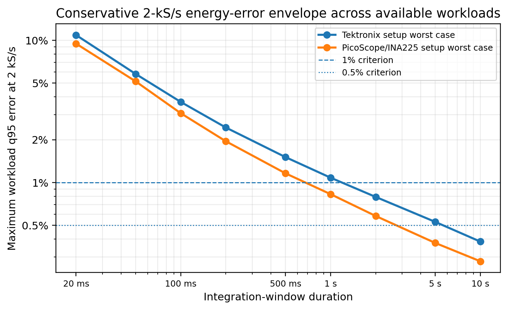

Quelle: `energy-measurement/evidence/spectra/sources/multi-workload-psd/paper_artifacts/figures`
